# BCM — Business Change Management

**BCM** is a Next.js web application for managing change requests in investment management. It enables first-time-right submission of benchmark switches, new benchmark requests, fee changes, mandate updates, and more — with built-in validation, IST/SOLL diff visualization, CSV/PDF export, and Coolify deployment monitoring.

> Built with Next.js 16, React 19, PostgreSQL, TypeScript, Sentry, and Playwright.

---

## Index

1. [Overview](#overview)
2. [Pages & Routes](#pages--routes)
3. [API Endpoints](#api-endpoints)
4. [Use Cases & Flow Charts](#use-cases--flow-charts)
5. [Scripts](#scripts)
6. [Infrastructure](#infrastructure)
7. [Tech Stack](#tech-stack)
8. [Getting Started](#getting-started)

---

## Overview

BCM allows investment professionals to:

- Select a client and one or more portfolios
- View the **IST** (current) benchmark per portfolio
- Select a **SOLL** (desired) benchmark from the catalog
- Request a **new benchmark** (inline or standalone)
- Submit fee changes, mandate changes, custodian changes, and more
- Review cost estimates and lead times per change type
- Submit the change request, which is stored in PostgreSQL
- Export the request as **CSV** or **PDF**
- Track changes via a **timeline** of GitHub commits
- Monitor **deployment status** via Coolify

---

## Pages & Routes

| Route | Page | Description |
|---|---|---|
| `/` | Home | Dashboard with stats, links to main workflows |
| `/changes/new` | Nieuwe change | Generic change form: select type, fill fields, review & submit |
| `/changes/[id]` | Change Detail | View submitted request with IST/SOLL diff, export, rationale |
| `/change-catalog` | Change Catalog | Overview of all 7 change types with process flow diagrams |
| `/change-catalog/[id]` | Change Type Detail | Detailed explanation and stakeholder flowchart per type |
| `/benchmarks` | Benchmark Catalog | Searchable, sortable table of all benchmarks + cost overview |
| `/benchmark-aanvraag` | Nieuwe Benchmark | 4-step form: standalone new benchmark request |
| `/updates` | Updates / Changelog | Timeline of recent GitHub commits + Coolify status pill |
| `/admin/client-config` | Client Config | Client/portfolio configuration with filtered table |
| `/admin/reports` | Reports | Dashboard with change request statistics and SLA insights |

---

## API Endpoints

| Method | Route | Description |
|---|---|---|
| `GET` | `/api/health` | Lightweight health check (DB connectivity, used by Docker HEALTHCHECK) |
| `GET` | `/api/commits` | Fetch recent GitHub commits from `rbnbrls/bcm` |
| `GET` | `/api/coolify-status` | Fetch Coolify application deployment status |
| `GET` | `/api/export/[id]?format=csv\|pdf` | Export a change request as CSV or PDF |
| `GET` | `/api/change-types` | List all active change type configs |
| `GET` | `/api/change-types/[slug]` | Get a single change type config by slug |
| `GET` | `/api/report-data` | Report data for the admin dashboard |
| `POST` | `/api/test-fee-change` | Test endpoint for fee change creation |

### Server Actions (form submissions)

| Action | Source | Description |
|---|---|---|
| `createBenchmarkChange` | `/changes/new/actions.ts` | Submit a benchmark switch (optionally with new benchmark creation) |
| `createNewBenchmark` | `/benchmark-aanvraag/actions.ts` | Submit a standalone new benchmark request |
| `submitGenericChange` | `/changes/new/generic-actions.ts` | Submit any generic change type (fee, mandate, custodian, etc.) |
| `submitFeedback` | `/feedback/actions.ts` | Submit feedback as a GitHub issue |

---

## Use Cases & Flow Charts

BCM supports a **data-driven change-type model** with 7 configurable change types. Each type has its own fields, cost model, stakeholders, and process flow — defined in the database, no code changes needed.

The general workflow for any change type follows these stages:

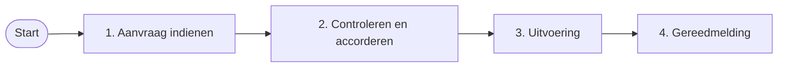

Below are the specific change types available in BCM.

---

### 1. Benchmarkwissel

Wijzig de benchmark van een portefeuille naar een andere benchmark uit de catalogus.

**Kosten**: Vanaf €0 + €500 per portefeuille
**Doorlooptijd**: 7 dagen

**Proces**:

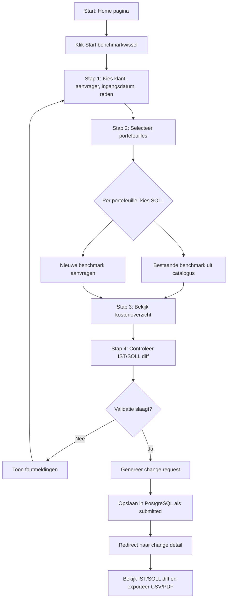

**Stakeholders**: Interne administratie, Asset service provider, FactSet

---

### 2. Nieuwe benchmark aanvragen

Voeg een nieuwe benchmark toe aan de catalogus (als onderdeel van een wissel of standalone).

**Kosten**: €5.000 eenmalig
**Doorlooptijd**: 28 dagen

**Proces** (standalone via `/benchmark-aanvraag`):

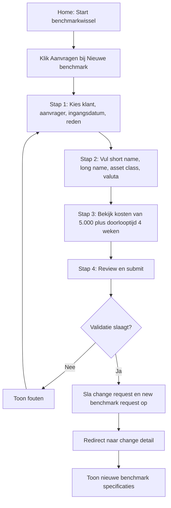

**Stakeholders**: Research team, Interne administratie

---

### 3. Tariefwijziging

Wijzig de beheervergoeding voor een portefeuille. Ondersteunt management fee, performance fee en vaste tarieven met IST/SOLL diff.

**Kosten**: €250 vast
**Doorlooptijd**: 10 dagen

**Proces**:

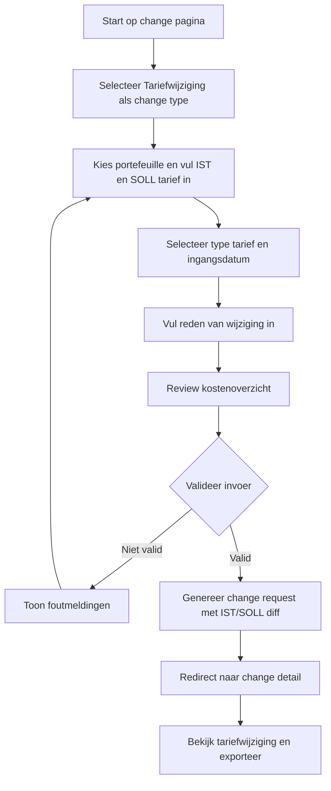

**Stakeholders**: Interne administratie, Asset service provider, FactSet

---

### 4. Mandaatwijziging

Wijzig de mandaatvoorwaarden van een portefeuille (discretionair, adviserend, of execution only).

**Kosten**: €350 vast
**Doorlooptijd**: 14 dagen

**Proces**:

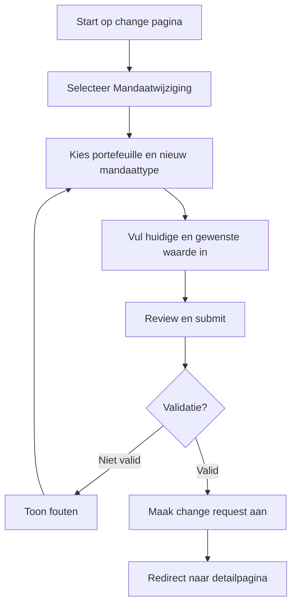

**Stakeholders**: Interne administratie, Asset service provider

---

### 5. Custodianwijziging

Wijzig de custodian van een portefeuille.

**Kosten**: €200 vast
**Doorlooptijd**: 21 dagen

**Proces**:

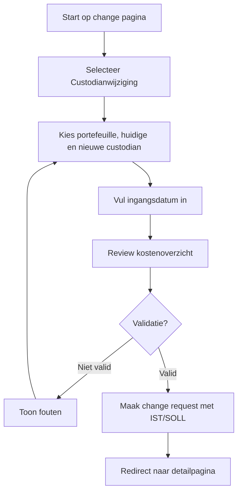

**Stakeholders**: Interne administratie, Asset service provider

---

### 6. Herbalanceringsdrempel instellen

Stel een herbalanceringsdrempel of -frequentie in voor een portefeuille.

**Kosten**: €150 vast
**Doorlooptijd**: 5 dagen

**Proces**:

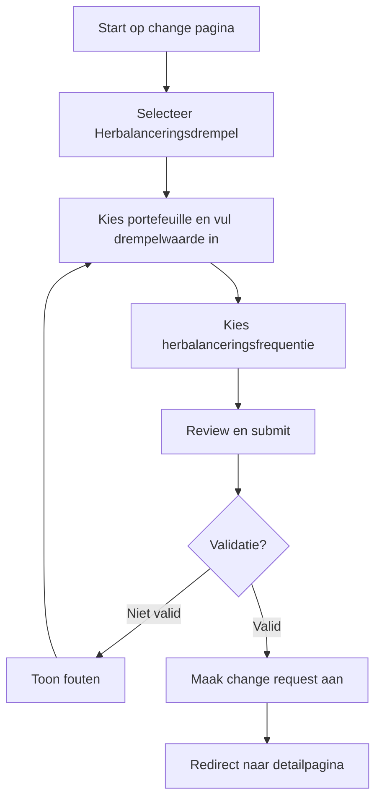

**Stakeholders**: Interne administratie, Asset service provider

---

### 7. Nieuwe klant on boarding

Onboard een nieuwe klant met FPR/SPR regeling en portfolio's.

**Kosten**: Geen kosten
**Doorlooptijd**: 1 dag

**Proces**:

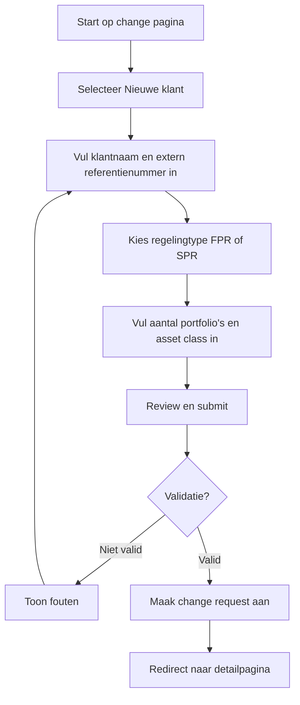

**Stakeholders**: Interne administratie, Asset service provider

---

### 8. Feedback indienen

Users can submit feedback from any page via a floating button.

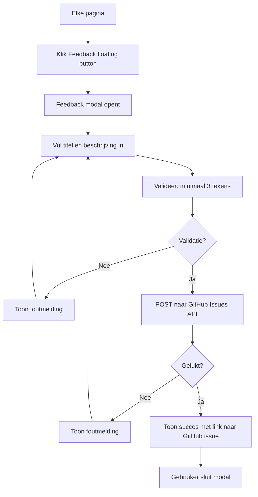

---

### 9. Change request exporteren (CSV / PDF)

After submitting a change request, the user can export it from the detail page.

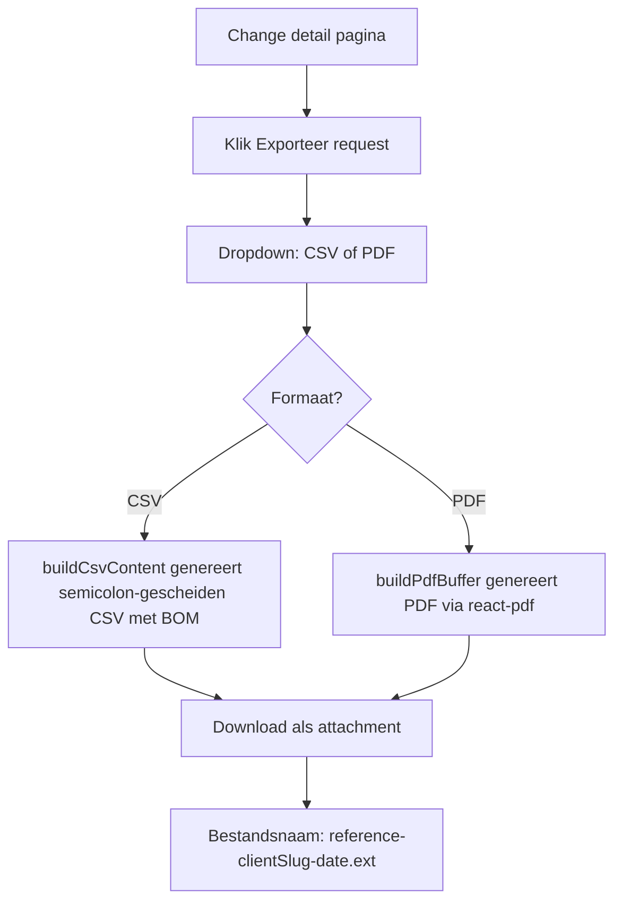

---

### 10. Updates en changelog

Users can view the deployment history and live Coolify status on the updates page.

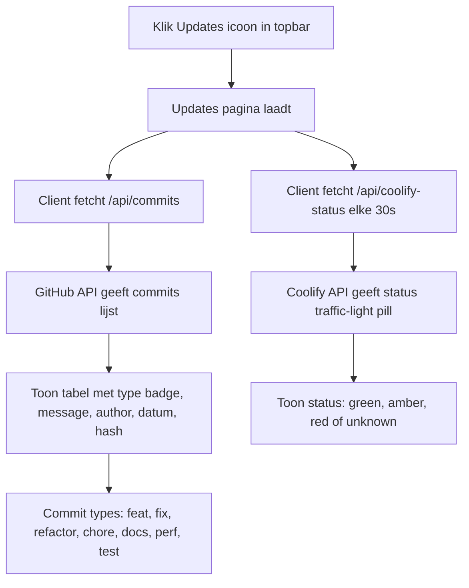

---

## Scripts

| Script | Description | Usage |
|---|---|---|
| `npm run dev` | Start Next.js development server | `npm run dev` |
| `npm run build` | Production build | `npm run build` |
| `npm run start` | Start production server | `npm start` |
| `npm run lint` | ESLint checks | `npm run lint` |
| `npm test` | Unit tests (Vitest) | `npm test` |
| `npm run test:e2e` | E2E tests (Playwright) | `npm run test:e2e` |
| `npm run db:migrate` | Run database migration | `npm run db:migrate` |
| `npm run db:seed` | Seed demo data | `npm run db:seed` |
| `node scripts/backup.mjs` | Manual database backup | `node scripts/backup.mjs` |

### Scripts details

| File | Description |
|---|---|
| `scripts/migrate.mjs` | Creates all 20 PostgreSQL tables (`clients`, `benchmark_catalog`, `portfolios`, `change_requests`, `change_request_items`, `new_benchmark_requests`, `change_type_config`, `audit_log`, `approvals`, `status_history`, `notification_config`, `notification_log`, `webhook_configs`, plus lookup tables `asset_classes`, `wtp_classifications`, `managers`, `benchmarks`, `regeling_types`, `sub_asset_classes`, `stakeholders`) with automatic retry + seeds demo data if DB is empty |
| `scripts/seed.mjs` | Standalone seed script for 12 benchmarks, 2 clients, 3 portfolios |
| `scripts/backup.mjs` | `pg_dump` wrapper with custom format, compression level 9, retention policy, dry-run mode |
| `scripts/startup.mjs` | Container entrypoint: runs migration (up to 3 attempts), then starts Next.js server with auto-restart on crash |

---

## Infrastructure

```
+-------------+     +--------------+     +-------------+
|  Coolify     |--->|  BCM App     |--->|  PostgreSQL  |
|  (deploy)    |     |  (Next.js)   |     |  (database)  |
+-------------+     +------+-------+     +-------------+
                           |
                    +------v-------+
                    |  GitHub API  |
                    |  (commits +  |
                    |   feedback)  |
                    +--------------+
```

- **Hosting**: Coolify v4 on Docker
- **Health check**: `GET /api/health` (lightweight, no SSR)
- **Error tracking**: Sentry (server, edge, client)
- **CI/CD**: GitHub Actions with automatic deployment
- **Monitoring**: Coolify status displayed in-app via status pill

---

## Database Schema

BCM uses a **PostgreSQL 17** database with a **3NF (Third Normal Form)** compliant schema. The schema is defined in `db/init.sql` (single source of truth) and managed through migration scripts in `scripts/migrate.mjs`.

The schema resolves 8 transitive dependency violations by replacing free-text columns with foreign key references to canonical lookup tables. This eliminates update anomalies and ensures referential integrity across all business-critical relations.

### Entity-Relationship Diagram

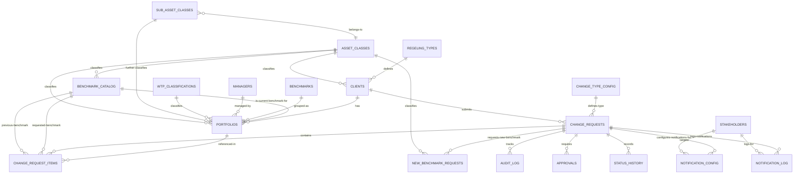

### Tables (20 tables across 7 categories)

| Table | Category | Rows (seed) | Description |
|-------|----------|-------------|-------------|
| `asset_classes` | Lookup | 8 | Asset class categories (Aandelen, Obligaties, etc.) with bilingual code/name |
| `wtp_classifications` | Lookup | 3 | WTP portfolio classification (Rendement, Matching, Opbouw) |
| `managers` | Lookup | 3 | Portfolio manager assignments (Eigen beheer, Externe beheerder) |
| `benchmarks` | Lookup | 3 | Benchmark group labels (Benchmark A/B/C) |
| `regeling_types` | Lookup | 4 | **3NF** — Pension fund arrangement types (replaces free-text on clients) |
| `sub_asset_classes` | Lookup | 10 | **3NF** — Sub-asset class categories per parent asset class |
| `stakeholders` | Lookup | 8 | **3NF** — Stakeholder roles (replaces free-text in notification tables) |
| `clients` | Core | 2 | Pension fund client master data |
| `benchmark_catalog` | Core | 17 | Market benchmark index catalog |
| `portfolios` | Core | 3 | Client portfolio definitions with mandatory attribute classifications |
| `change_type_config` | Config | 7 | Generic change-type definitions (JSONB-driven extensible model) |
| `change_requests` | Workflow | — | Central workflow entity: tracks changes from draft through validation |
| `change_request_items` | Workflow | — | Per-portfolio benchmark switch items within a change request |
| `new_benchmark_requests` | Workflow | — | New benchmark creation sub-requests |
| `audit_log` | Audit | — | Change request audit trail |
| `approvals` | Audit | — | Approval records per change request |
| `status_history` | Audit | — | Status transition history |
| `notification_config` | Notification | — | Per-stakeholder notification routing (webhook/email) |
| `notification_log` | Notification | — | Notification delivery log with retry state |
| `webhook_configs` | Integration | — | Webhook endpoint configuration |

### 3NF Migration Summary

The normalization analysis identified 8 transitive dependency violations across 6 tables. These were resolved by:

| # | Table | Violation | Fix |
|---|-------|-----------|-----|
| 1 | `portfolios` | Redundant `asset_class`/`sub_asset_class` text duplicated lookup values | FK to `asset_classes(id)` + new `sub_asset_classes` lookup |
| 2 | `clients` | Free-text `asset_class` and `regeling_type` with no FK/CHECK | FK to `asset_classes(id)` + new `regeling_types` lookup |
| 3 | `benchmark_catalog` | `asset_class` text duplicated `asset_classes` names | FK to `asset_classes(id)` |
| 4 | `new_benchmark_requests` | `asset_class` text with same duplication | FK to `asset_classes(id)` |
| 5 | `change_requests` | `change_type` text redundant with `change_type_id` FK | Made `change_type_id NOT NULL`, legacy column retained for BC |
| 6 | `notification_config/log` | Free-text `stakeholder` duplicated across two tables | FK to new `stakeholders` lookup table |

Legacy text columns are retained on the tables for backward compatibility but marked with comments. New writes populate the FK columns; the application's write paths have been updated accordingly.

### Key Relationships

- **clients → portfolios**: One-to-many. A pension fund may have multiple portfolios (return, matching, etc.).
- **clients → regeling_types / asset_classes**: Many-to-one via FK (3NF: replaced free text).
- **portfolios → benchmark_catalog**: Each portfolio has exactly one current benchmark (`ON DELETE RESTRICT`).
- **portfolios → asset_classes / sub_asset_classes / wtp_classifications / managers / benchmarks**: Mandatory attribute classifications via FK.
- **change_requests → clients**: A change request belongs to exactly one client.
- **change_requests → change_type_config**: Mandatory change-type via FK (3NF: now `NOT NULL`).
- **change_requests → change_request_items**: One-to-many; each item references a portfolio and its benchmark switch.
- **change_requests → audit_log / approvals / status_history**: Audit records cascade on change request deletion.
- **change_requests → notification_config / notification_log**: Notification configuration and delivery logs.
- **notification_config/log → stakeholders**: Mandatory stakeholder FK (3NF: replaced free-text).

### Design Decisions

1. **UUID primary keys throughout** — Enables offline-created records and avoids sequential ID exposure.
2. **`ON DELETE CASCADE` for child records** — Audit logs, approvals, status history, and notification records cascade with their parent change request.
3. **`ON DELETE RESTRICT` for benchmarks** — Prevents deletion of benchmarks actively referenced by portfolios or change request items.
4. **SLA trigger** — A `BEFORE INSERT OR UPDATE` trigger computes `sla_status` and `sla_days_open`, eliminating application-level Date computations. A scheduled job handles time-based drift.
5. **Generic change-type model** — `change_type_config` uses JSONB columns for extensible field definitions, stakeholder assignments, and process flows. This is a deliberate flexibility-vs-consistency trade-off.
6. **Partial indexes** — `idx_cr_sla_status_non_terminal` and `idx_cr_notification_sent` reduce index size on completed records.
7. **3NF with pragmatic exceptions** — Transitive dependencies in business data are fully normalized. JSONB in `change_type_config` is preserved for extensibility. See the full [Normalization Analysis](documentation/database/data-model/normalization-analysis.md) for details.

### Performance

The schema includes **37 indexes** optimized for common query patterns:

| Category | Count | Purpose |
|----------|-------|---------|
| FK indexes | 20 | Prevent sequential scans on foreign-key joins |
| Filter/sort indexes | 10 | Accelerate common WHERE and ORDER BY clauses |
| Composite indexes | 4 | Support multi-column query patterns |
| Partial indexes | 2 | Cover filtered queries (non-terminal SLA, unsent notifications) |
| Unique functional | 1 | Application-level dedup on notification config |

The SLA status query benchmarks at **0.16ms** — a 92% improvement over the previous application-level computation.

Full documentation in the [Database Data Model](documentation/database/data-model/) directory, including individual OKF-format table docs, row-by-row index inventory, and normalization analysis.

---

## Tech Stack

| Technology | Purpose |
|---|---|
| **Next.js 16** | React framework (App Router, server components, server actions) |
| **React 19** | UI library |
| **TypeScript** | Type safety |
| **PostgreSQL 17** | Database |
| **postgres** (npm) | PostgreSQL client |
| **Zod** | Schema validation for form data |
| **@react-pdf/renderer** | PDF export |
| **Sentry** | Error tracking |
| **Playwright** | E2E tests |
| **Vitest** | Unit tests |
| **Docker** | Containerization (multi-stage build) |
| **Mermaid** | Client-side process flow diagram rendering |

---

## Getting Started

### Prerequisites

- Node.js 22+
- PostgreSQL 17 (or Docker)
- GitHub token (optional, for commits + feedback)

### Local Development

```bash
# Start PostgreSQL (Docker)
docker compose up -d db

# Install dependencies
npm ci

# Copy environment variables
cp .env.example .env.local

# Run database migration
npm run db:migrate

# Start dev server
npm run dev
```

### Environment Variables

| Variable | Required | Description |
|---|---|---|
| `DATABASE_URL` | No (demo mode) | PostgreSQL connection string |
| `GITHUB_TOKEN` | No | GitHub API token for commits/feedback |
| `COOLIFY_API_TOKEN` | No | Coolify API token for status |
| `COOLIFY_HOST` | No | Coolify base URL (default: `http://coolify:8000`) |
| `COOLIFY_APP_UUID` | No | Coolify application UUID |

### Production Build

```bash
npm run build
npm start
# or: docker compose up
```

---

## License

MIT
