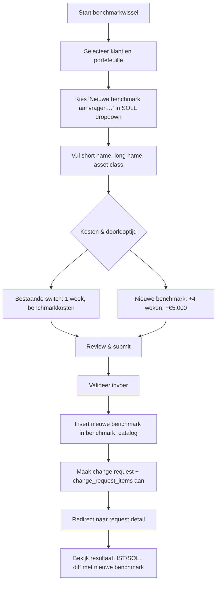
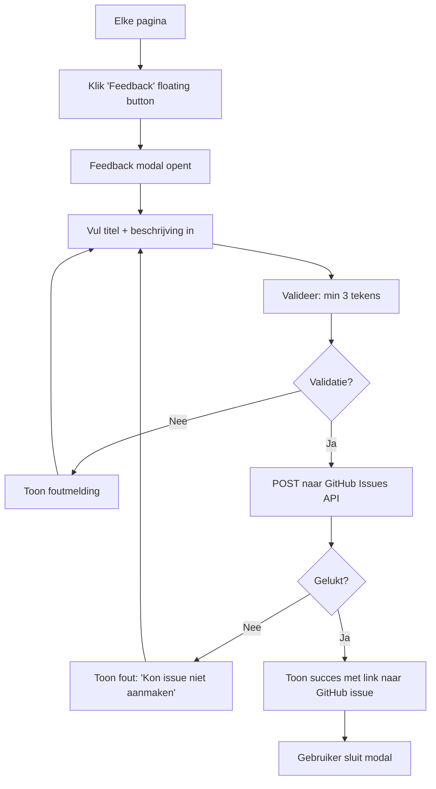
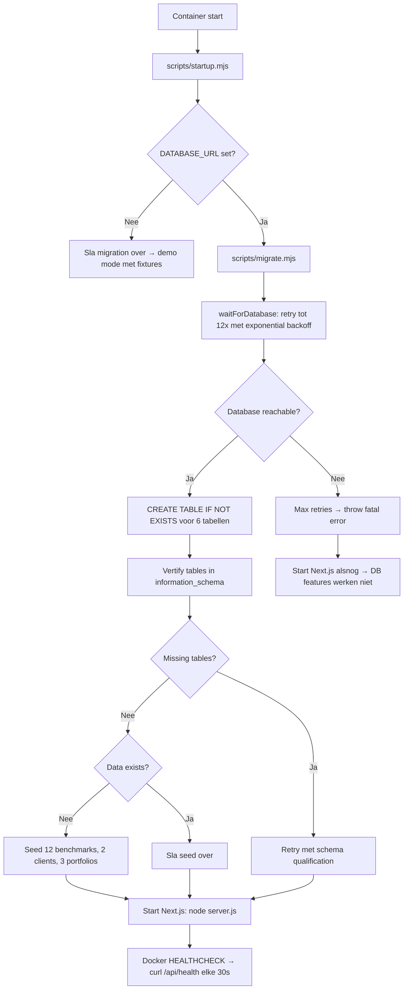

# BCM — Business Change Management

**BCM** is a Next.js web application for managing change requests in investment management. It enables first-time-right submission of benchmark switches and new benchmark requests, with built-in validation, IST/SOLL diff visualization, CSV/PDF export, and Coolify deployment monitoring.

> Built with Next.js 16, React 19, PostgreSQL, TypeScript, Sentry, and Playwright.

---

## Index

1. [Overview](#overview)
2. [Pages & Routes](#pages--routes)
3. [API Endpoints](#api-endpoints)
4. [Use Cases](#use-cases--flow-charts)
5. [Scripts](#scripts)
6. [Infrastructure](#infrastructure)
7. [Tech Stack](#tech-stack)
8. [Getting Started](#getting-started)

---

## Overview

BCM allows investment professionals to:

- Select a client and one or more portfolios
- View the **IST** (current) benchmark per portfolio
- Select a **SOLL** (desired) benchmark from the catalog
- Request a **new benchmark** (inline or standalone)
- Review cost estimates and lead times
- Submit the change request, which is stored in PostgreSQL
- Export the request as **CSV** or **PDF**
- Track changes via a **timeline** of GitHub commits
- Monitor **deployment status** via Coolify

---

## Pages & Routes

| Route | Page | Description |
|---|---|---|
| `/` | Home | Dashboard with stats, links to main workflows |
| `/changes/new` | Benchmarkwissel | 4-step form: select client, portfolios, SOLL benchmark, review & submit |
| `/changes/[id]` | Change Detail | View submitted request with IST/SOLL diff, export, rationale |
| `/benchmark-aanvraag` | Nieuwe Benchmark | 4-step form: standalone new benchmark request |
| `/benchmarks` | Benchmark Catalog | Searchable, sortable table of all benchmarks + cost overview |
| `/updates` | Updates / Changelog | Timeline of recent GitHub commits + Coolify status pill |
| `/admin/client-config` | Client Config | Client/portfolio configuration with filtered table |

---

## API Endpoints

| Method | Route | Description |
|---|---|---|
| `GET` | `/api/health` | Lightweight health check (DB connectivity, used by Docker HEALTHCHECK) |
| `GET` | `/api/commits` | Fetch recent GitHub commits from `rbnbrls/bcm` |
| `GET` | `/api/coolify-status` | Fetch Coolify application deployment status |
| `GET` | `/api/export/[id]?format=csv\|pdf` | Export a change request as CSV or PDF |

### Server Actions (form submissions)

| Action | Source | Description |
|---|---|---|
| `createBenchmarkChange` | `/changes/new/actions.ts` | Submit a benchmark switch (optionally with new benchmark creation) |
| `createNewBenchmark` | `/benchmark-aanvraag/actions.ts` | Submit a standalone new benchmark request |
| `submitFeedback` | `/feedback/actions.ts` | Submit feedback as a GitHub issue |

---

## Use Cases & Flow Charts

### 1. Benchmark Switch (Benchmarkwissel)

The primary use case. A portfolio manager wants to switch one or more portfolios from their current benchmark to a different one from the catalog.

```mermaid
flowchart TD
    A["Start: Home page"] --> B["Klik 'Start benchmarkwissel'"]
    B --> C[Step 1: Kies klant, aanvrager, ingangsdatum, reden]
    C --> D[Step 2: Selecteer portefeuilles]
    D --> E{Per portefeuille: kies SOLL}
    E --> F[Bestaande benchmark uit catalogus]
    E --> G[Nieuwe benchmark aanvragen → vul short/long name + asset class]
    F --> H[Step 3: Bekijk kostenoverzicht]
    G --> H
    H --> I[Step 4: Controleer IST/SOLL diff]
    I --> J{Validatie slaagt?}
    J -->|Nee| K[Toon foutmeldingen]
    K --> C
    J -->|Ja| L[Genereer change request]
    L --> M["Opslaan in PostgreSQL (status: submitted)"]
    M --> N[Redirect naar /changes/[id]]
    N --> O[Bekijk IST/SOLL diff + exporteer CSV/PDF]
```

### 2. Benchmark Switch with New Benchmark Creation

When the desired benchmark does not exist in the catalog, the user creates it inline during the switch process.



### 3. Standalone New Benchmark Request

When a new benchmark is needed outside of a benchmark switch.

```mermaid
flowchart TD
    A[Home: Start benchmarkwissel] --> B[Klik 'Aanvragen' bij 'Nieuwe benchmark aanvragen']
    B --> C[Step 1: Kies klant, aanvrager, ingangsdatum, reden]
    C --> D[Step 2: Vul short name, long name, asset class, valuta]
    D --> E["Step 3: Bekijk kosten (€5.000) + doorlooptijd (4 weken)"]
    E --> F[Step 4: Review & submit]
    F --> G{Validatie slaagt?}
    G -->|Nee| H[Toon fouten]
    H --> C
    G -->|Ja| I[Sla change_request + new_benchmark_request op]
    I --> J[Redirect naar /changes/[id]]
    J --> K[Toon nieuwe benchmark specificaties]
```

### 4. Feedback Submission

Users can submit feedback from any page via a floating button.



### 5. Export Change Request (CSV / PDF)

After submitting a change request, the user can export it.

```mermaid
flowchart TD
    A[/changes/[id] pagina] --> B[Klik 'Exporteer request']
    B --> C[Dropdown: CSV of PDF]
    C --> D{Formaat?}
    D -->|CSV| E[buildCsvContent → semicolon-delimited CSV met BOM]
    D -->|PDF| F[buildPdfBuffer → @react-pdf rendered PDF]
    E --> G[Download als attachment]
    F --> G
    G --> H[Bestandsnaam: {reference}-{clientSlug}-{date}.{ext}]
```

### 6. Updates & Changelog Timeline

Users can view the deployment history and live Coolify status.

```mermaid
flowchart TD
    A[Klik 'Updates' icoon in topbar] --> B[/updates pagina laadt]
    B --> C[Client: fetch /api/commits]
    B --> D[Client: fetch /api/coolify-status elke 30s]
    C --> E[GitHub API → commits lijst]
    D --> F[Coolify API → status traffic-light pill]
    E --> G[Toon tabel: type badge, message, author, datum, hash]
    F --> H[Toon status: green/amber/red/unknown]
    G --> I[Commit types: feat/fix/refactor/chore/docs/perf/test]
```

### 7. Database Migration (Startup Flow)

Automatic on container startup — creates tables and seeds demo data if empty.



### 8. Database Backup Flow

Automated via docker-compose cron or manual execution.

```mermaid
flowchart TD
    A[Backup trigger] --> B{dagelijks om 03:00 \\ of handmatig}
    B --> C[scripts/backup.mjs]
    C --> D[Parse DATABASE_URL]
    D --> E[pd_dump --format=custom --compress=9]
    E --> F[Output: /backups/bcm-{timestamp}.dump]
    F --> G[Retentie: verwijder backups ouder dan N dagen]
    G --> H[Standaard 7 dagen retentie]
```

---

## Scripts

| Script | Description | Usage |
|---|---|---|
| `npm run dev` | Start Next.js development server | `npm run dev` |
| `npm run build` | Production build | `npm run build` |
| `npm run start` | Start production server | `npm start` |
| `npm run lint` | ESLint checks | `npm run lint` |
| `npm test` | Unit tests (Vitest) | `npm test` |
| `npm run test:e2e` | E2E tests (Playwright) | `npm run test:e2e` |
| `npm run db:migrate` | Run database migration | `npm run db:migrate` |
| `npm run db:seed` | Seed demo data | `npm run db:seed` |
| `node scripts/backup.mjs` | Manual database backup | `node scripts/backup.mjs` |

### Scripts details

| File | Description |
|---|---|
| `scripts/migrate.mjs` | Creates 6 PostgreSQL tables (`clients`, `benchmark_catalog`, `portfolios`, `change_requests`, `change_request_items`, `new_benchmark_requests`) with automatic retry + seeds demo data if DB is empty |
| `scripts/seed.mjs` | Standalone seed script for 12 benchmarks, 2 clients, 3 portfolios |
| `scripts/backup.mjs` | `pg_dump` wrapper with custom format, compression level 9, retention policy, dry-run mode |
| `scripts/startup.mjs` | Container entrypoint: runs migration (up to 3 attempts), then starts Next.js server with auto-restart on crash |

---

## Database Schema

The application uses 6 PostgreSQL tables, created automatically via `ensureReadTables` on first query if they do not exist:

```
clients          → id, name, external_reference, status, created_at
benchmark_catalog → id, code, name, asset_class, currency, cost, provider, active
portfolios       → id, client_id → clients, name, external_reference, current_benchmark_id → benchmark_catalog, currency, active
change_requests  → id, reference, change_type, client_id → clients, requested_by, rationale, effective_date, status, created_at
change_request_items → id, change_request_id → change_requests, portfolio_id → portfolios, previous_benchmark_id → benchmark_catalog, requested_benchmark_id → benchmark_catalog
new_benchmark_requests → id, change_request_id → change_requests, short_name, long_name, asset_class, currency, estimated_cost, estimated_lead_weeks
```

---

## Library Modules

| Module | Exports | Description |
|---|---|---|
| `lib/db.ts` | `getBenchmarks`, `getClientConfigs`, `saveChangeRequest`, `saveNewBenchmarkRequest`, `getChangeRequest`, `insertBenchmark`, `ensureReadTables` | Database access with automatic table creation and fixture fallback |
| `lib/github.ts` | `fetchRecentCommits` | Fetch recent commits from `rbnbrls/bcm` via GitHub API |
| `lib/coolify.ts` | `getCoolifyStatus`, `mapStatus` | Fetch Coolify application status, map to traffic-light levels |
| `lib/export.ts` | `buildCsvContent`, `buildExportFilename`, `buildPdfBuffer` | CSV and PDF export utilities |
| `lib/export-pdf.tsx` | `buildPdfBuffer` | React-PDF document component and buffer generator |
| `lib/fixtures.ts` | `benchmarks`, `demoClientConfigs` | Demo data for development without database |
| `lib/types.ts` | `Benchmark`, `Portfolio`, `ClientConfig`, `ChangeItem`, `ChangeRequest`, `NewBenchmarkRequest` | Shared TypeScript types |

---

## Components

| Component | File | Description |
|---|---|---|
| `BenchmarkChangeForm` | `components/benchmark-change-form.tsx` | 4-step form for benchmark switch with IST/SOLL selection and inline new benchmark creation |
| `NewBenchmarkForm` | `components/benchmark-new-form.tsx` | 4-step form for standalone new benchmark request |
| `ExportButton` | `components/export-button.tsx` | Split button with CSV/PDF download dropdown for change request detail page |
| `FeedbackButton` | `components/feedback-button.tsx` | Floating action button that opens a feedback modal → GitHub issue |
| `UpdatesTimeline` | `components/updates-timeline.tsx` | Commit timeline table with type badges, time-ago formatting, Coolify status pill |
| `BenchmarkCatalogTable` | `app/benchmarks/benchmark-catalog-table.tsx` | Searchable, sortable benchmark table with 6 columns |
| `ClientConfigTable` | `app/admin/client-config/client-config-table.tsx` | Client config table with per-column filters and sorting |

---

## Infrastructure

```
┌─────────────┐     ┌──────────────┐     ┌─────────────┐
│  Coolify     │────▶│  BCM App     │────▶│  PostgreSQL  │
│  (deploy)    │     │  (Next.js)   │     │  (database)  │
└─────────────┘     └──────┬───────┘     └─────────────┘
                           │
                    ┌──────▼───────┐
                    │  GitHub API  │
                    │  (commits +  │
                    │   feedback)  │
                    └──────────────┘
```

- **Hosting**: Coolify v4 on Docker
- **Health check**: `GET /api/health` (lightweight, no SSR)
- **Error tracking**: Sentry (server, edge, client)
- **CI/CD**: GitHub Actions with automatic deployment
- **Monitoring**: Coolify status displayed in-app via status pill

---

## Tech Stack

| Technology | Purpose |
|---|---|
| **Next.js 16** | React framework (App Router, server components, server actions) |
| **React 19** | UI library |
| **TypeScript** | Type safety |
| **PostgreSQL 17** | Database |
| **postgres** (npm) | PostgreSQL client |
| **Zod** | Schema validation for form data |
| **@react-pdf/renderer** | PDF export |
| **Sentry** | Error tracking |
| **Playwright** | E2E tests |
| **Vitest** | Unit tests |
| **Docker** | Containerization (multi-stage build) |

---

## Generic Change-Type Model

BCM supports a **data-driven change-type model** that generalises beyond the two hardcoded types (`benchmark_switch`, `new_benchmark`).

### Database

The `change_type_config` table stores type definitions as JSONB:

| Column | Type | Description |
|--------|------|-------------|
| `id` | uuid | Primary key |
| `slug` | text (unique) | Machine key (e.g. `benchmark_switch`) |
| `name` | text | Dutch display name |
| `category` | text | Grouping (e.g. `benchmark`, `mandate`, `fee`) |
| `fields` | jsonb | Array of `ChangeField` definitions (IST/SOLL pairs) |
| `ist_soll_mapping` | jsonb | Which fields form the current/desired state diff |
| `cost` | jsonb | `{baseCost, costCurrency, perItemCost?, description}` |
| `default_lead_days` | integer | Default lead time in calendar days |
| `stakeholders` | jsonb | Array of `StakeholderDef` with trigger points |
| `workflow` | text | Reference to a status workflow |

### Migration

Two types are seeded on first deploy: `benchmark_switch` and `new_benchmark`. The `change_requests` table was extended with nullable columns (`change_type_id`, `fields`, `stakeholders`, `estimated_cost`, `estimated_cost_currency`, `estimated_lead_days`) for backward compatibility.

### Reading Types

- `getChangeTypes()` — list all active types (falls back to in-memory defaults without a database)
- `getChangeTypeBySlug(slug)` — get a single type by slug
- `getChangeRequest(id)` — returns `changeTypeConfig` with the resolved type config

See `lib/types.ts` for the full TypeScript definitions and `lib/db.ts` for the data access layer.

---

## Getting Started

### Prerequisites

- Node.js 22+
- PostgreSQL 17 (or Docker)
- GitHub token (optional, for commits + feedback)

### Local Development

```bash
# Start PostgreSQL (Docker)
docker compose up -d db

# Install dependencies
npm ci

# Copy environment variables
cp .env.example .env.local

# Run database migration
npm run db:migrate

# Start dev server
npm run dev
```

### Environment Variables

| Variable | Required | Description |
|---|---|---|
| `DATABASE_URL` | No (demo mode) | PostgreSQL connection string |
| `GITHUB_TOKEN` | No | GitHub API token for commits/feedback |
| `COOLIFY_API_TOKEN` | No | Coolify API token for status |
| `COOLIFY_HOST` | No | Coolify base URL (default: `http://coolify:8000`) |
| `COOLIFY_APP_UUID` | No | Coolify application UUID |

### Production Build

```bash
npm run build
npm start
# or: docker compose up
```

---

## License

MIT
