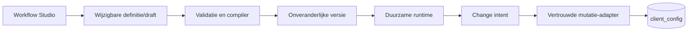

# Architectuur

Deze map beschrijft zowel de huidige BCM-architectuur als de doelarchitectuur voor
de no-code Workflow Studio. Een besluit in een ADR is een ontwerpcontract en
betekent niet automatisch dat de bijbehorende implementatie al gereed is.

## Workflow Studio

- [Domeinwoordenlijst](workflow-studio-domain-glossary.md)
- [ADR-index](decisions/README.md)
- [Implementatieplan](../workflow-studio-implementation-plan.md)

De huidige applicatie registreert change types en hun uitvoerstrategie grotendeels
in code (`lib/change-type-registry.ts`, `lib/change-types/templates.ts` en
`lib/apply-strategies.ts`). Het doelmodel scheidt authoring, onveranderlijke
publicatieversies, duurzame runtime en beveiligde client-configmutaties.

## Overige architectuurdocumentatie

- [Client configuration architecture](../client-configuration-architecture.md)
- [Database-documentatie](../database/README.md)
- [API-documentatie](../api/README.md)
