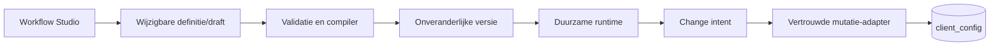

# Architectuur

Deze map beschrijft zowel de huidige BCM-architectuur als de doelarchitectuur voor
de no-code Workflow Studio. Een besluit in een ADR is een ontwerpcontract en
betekent niet automatisch dat de bijbehorende implementatie al gereed is.

## Workflow Studio

- [Domeinwoordenlijst](workflow-studio-domain-glossary.md)
- [ADR-index](decisions/README.md)
- [Implementatieplan](../workflow-studio-implementation-plan.md)
- [Operating handbook](../workflow-studio/README.md)
- [Pilot and rollout](../workflow-studio/workflow-pilot-rollout.md)
- [Runtime apply](workflow-runtime-apply.md)
- [Runtime analytics](workflow-runtime-analytics.md)
- [Runtime calendars](workflow-runtime-calendars.md)
- [Runtime change intents](workflow-runtime-change-intents.md)
- [Runtime cutover](workflow-runtime-cutover.md)
- [Runtime cutover catalog](workflow-runtime-cutover-catalog.md)
- [Runtime decisions](workflow-runtime-decisions.md)
- [Runtime detail](workflow-runtime-detail.md)
- [Runtime evidence](workflow-runtime-evidence.md)
- [Runtime dashboard](workflow-runtime-dashboard.md)
- [Runtime integrations](workflow-runtime-integrations.md)
- [Runtime notifications](workflow-runtime-notifications.md)
- [Runtime outbox](workflow-runtime-outbox.md)
- [Runtime multi-approvals](workflow-runtime-multi-approvals.md)
- [Runtime parallel gateways](workflow-runtime-parallel-gateways.md)
- [Runtime recovery](workflow-runtime-recovery.md)
- [Runtime scale and chaos recovery](workflow-runtime-scale-chaos.md)
- [Runtime shadow mode](workflow-runtime-shadow-mode.md)
- [Runtime subworkflows](workflow-runtime-subworkflows.md)
- [Runtime timers](workflow-runtime-timers.md)
- [Security and privacy hardening](workflow-security-privacy-hardening.md)
- [Template library](workflow-template-library.md)
- [Version governance](workflow-version-governance.md)
- [Workflow accessibility and UX completion](workflow-accessibility-ux.md)
- [Workflow governance policies](workflow-governance-policies.md)

De huidige applicatie registreert change types en hun uitvoerstrategie grotendeels
in code (`lib/change-type-registry.ts`, `lib/change-types/templates.ts` en
`lib/apply-strategies.ts`). Het doelmodel scheidt authoring, onveranderlijke
publicatieversies, duurzame runtime en beveiligde client-configmutaties.

## Overige architectuurdocumentatie

- [Client configuration architecture](../client-configuration-architecture.md)
- [Database-documentatie](../database/README.md)
- [API-documentatie](../api/README.md)
