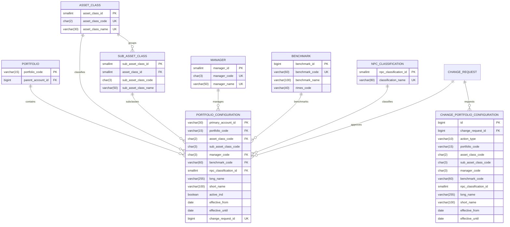

# Client Configuration — 3NF Architecture

## 1. Goal

Replace the flat client-configuration Excel dump with a fully normalised
PostgreSQL model in **Third Normal Form (3NF)**.  All configuration changes
must flow through the existing BCM change-management workflow; direct DML
against configuration tables is prohibited by construction.

## 2. ERD



## 3. 3NF Design

- Every non-primary-key attribute is fully functionally dependent on the PK.
- Lookup domains (asset class, sub-asset class, manager, benchmark,
  NPC classification) are separate tables with natural/business-key candidates
  explicitly UNIQUE-constrained.
- `portfolio_configuration` is a fact/configuration table referencing those
  lookups; it contains no repeating groups or transitive dependencies.

### Business key

```
primary_account_id =
  {portfolio_code}_{asset_class_code}{sub_asset_class_code}_{manager_code}
```

Example: `ADP_FIHYG_ROB`

## 4. Business Rules

### Validation
- `portfolio_code`, `asset_class_code`, `sub_asset_class_code`, `manager_code`
  are required and validated by FK + NOT NULL + CHECK.
- `long_name`: 1–255 chars, no CR/LF.
- `short_name`: 1–100 chars, no CR/LF.
- `benchmark_code`: NOT NULL, non-empty string.
- `effective_until` >= `effective_from` when present.
- `primary_account_id` pattern matches generated business key.

### Change-Management Integration
- Direct writes to `portfolio_configuration` are not permitted by application
  logic.  All mutations must be submitted as a `change_request` whose
  implementation phase applies approved changes.
- `change_portfolio_configuration` records the intended `action_type`
  (`CREATE`, `UPDATE`, `DELETE`) and payload.

## 5. Change Process

1. User submits a change request.
2. Impact assessment runs.
3. Approval gate.
4. Implementation phase writes/updates `portfolio_configuration` using the
   staged row in `change_portfolio_configuration`.
5. Audit via existing `audit_log`/`approvals` pattern.

## 6. Migration Strategy

- New tables are created with schema-qualified DDL under `client_config`.
- Existing `client_config.account` remains the source of truth for dimension
  combinations; `portfolio_configuration` is effectively a configuration overlay
  keyed by `primary_account_id`.
- Backfill/migration service populates `portfolio_configuration` from legacy
  flat configuration data after validation.

## 7. Rollback

- Drop the three new tables/indexes.
- Revert application code to previous schema-bound entities.
- Legacy flat configuration view/table remains available until full cutover.

## 8. Code Map

- DDL: `db/clientconfig_schema.sql`
- Entities: `lib/entities/*.ts`
- Zod: `lib/schemas/domain.ts`
- Helpers: `lib/portfolio-config.ts`
- Tests: `tests/portfolio-config.test.ts`
