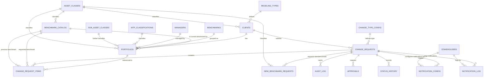

# BCM Data Model

> Open Knowledge Format (OKF) v0.1 bundle documenting the PostgreSQL relational data model for the BCM (Beheer Client Mutaties) application.

okf_version: "0.1"

---

## Overview

BCM manages benchmark change requests for pension fund clients. The data model supports:

- **Client & portfolio management** — Pension funds (clients) with one or more portfolios, each tracked against a market benchmark.
- **Benchmark change workflows** — Change requests that switch a portfolio from one benchmark to another, or request new custom benchmarks.
- **Generic change-type model** — Extensible configuration-driven change types with custom fields, cost models, stakeholder assignments, and process flows.
- **SLA tracking** — Automated SLA status computation via database triggers with "ok", "at_risk", and "overdue" states.
- **Audit & compliance** — Full audit log, approval chain, and status history for every change request.
- **Notification system** — Configurable webhook/email notifications per stakeholder, with delivery retry logic.

The schema is defined in `db/init.sql` and applied to PostgreSQL via Docker Compose on first volume creation. Migration scripts in `scripts/migrate.mjs` handle schema evolution for existing deployments.

---

## Entity-Relationship Diagram

---

## Tables (Concepts)

| Table | Type | Description |
|-------|------|-------------|
| [clients](clients.md) | Core | Pension fund client master data |
| [benchmark_catalog](benchmark-catalog.md) | Core | Market benchmark index catalog |
| [portfolios](portfolios.md) | Core | Client portfolio definitions |
| [change_requests](change-requests.md) | Workflow | Benchmark change request records |
| [change_request_items](change-request-items.md) | Workflow | Per-portfolio additions within a change request |
| [new_benchmark_requests](new-benchmark-requests.md) | Workflow | New benchmark creation sub-requests |
| [change_type_config](change-type-config.md) | Configuration | Generic change-type definitions |
| [audit_log](audit-log.md) | Audit | Change request audit trail |
| [approvals](approvals.md) | Audit | Approval records per change request |
| [status_history](status-history.md) | Audit | Status transition history |
| [admin_audit_log](admin-audit-log.md) | Audit | Out-of-band admin bypass mutations on client_config portfolio/parent_account |
| [notification_config](notification-config.md) | Notification | Per-stakeholder notification routing |
| [notification_log](notification-log.md) | Notification | Notification delivery log |
| [webhook_configs](webhook-configs.md) | Integration | Webhook endpoint configuration |
| [asset_classes](asset-classes.md) | Lookup | Asset class categories with bilingual code/name |
| [wtp_classifications](wtp-classifications.md) | Lookup | WTP portfolio classification |
| [managers](managers.md) | Lookup | Portfolio manager assignments |
| [benchmarks](benchmarks.md) | Lookup | Benchmark group labels |
| [regeling_types](regeling-types.md) | Lookup | Pension fund arrangement types |
| [sub_asset_classes](sub-asset-classes.md) | Lookup | Sub-asset class categories |
| [stakeholders](stakeholders.md) | Lookup | Stakeholder roles |
| [client_onboarding_staging](client-onboarding-staging.md) | Staging | Pending onboarding records for new clients (client + initial portfolio metadata) |

### Analysis

| Document | Description |
|----------|-------------|
| [Normalization Analysis](normalization-analysis.md) | 1NF/2NF/3NF analysis with 14 identified violations and recommended fixes |
| [3NF Schema Design](3nf-schema-design.md) | 3NF-compliant redesign — resolves 8 transitive dependency violations with DDL migration |
---

## Key Relationships

- **clients → portfolios**: One-to-many. A pension fund (client) may have multiple portfolios (e.g., return portfolio, matching portfolio).
- **clients → asset_classes**: Optional many-to-one via `asset_class_id` (3NF: replaced free-text `asset_class`).
- **clients → regeling_types**: Optional many-to-one via `regeling_type_id` (3NF: replaced free-text `regeling_type`).
- **benchmark_catalog → portfolios**: Each portfolio references exactly one current benchmark; the benchmark is protected from deletion by `ON DELETE RESTRICT`.
- **benchmark_catalog → asset_classes**: Mandatory many-to-one via `asset_class_id` (3NF: replaced free-text `asset_class`).
- **clients → change_requests**: A client submits change requests. Each CR belongs to exactly one client.
- **change_requests → change_type_config**: Mandatory many-to-one via `change_type_id` (3NF: removed redundant `change_type` text).
- **change_requests → change_request_items**: A change request can contain multiple items, each referencing a portfolio and its benchmark switch (previous → requested).
- **change_requests → audit_log, approvals, status_history**: Audit records cascade on change request deletion.
- **notification_config/log → stakeholders**: Mandatory many-to-one via `stakeholder_id` (3NF: replaced free-text `stakeholder`).
- **portfolios → sub_asset_classes**: Optional many-to-one via `sub_asset_class_id` (3NF: replaced free-text `sub_asset_class`).

---

## Design Decisions

1. **UUID primary keys throughout** — All tables use UUID v4 primary keys, generated client-side or via `pgcrypto`. This enables offline-created records and avoids sequential ID exposure.

2. **`ON DELETE CASCADE` for child records** — Audit logs, approvals, status history, and notification records cascade delete with their parent change request, simplifying cleanup.

3. **`ON DELETE RESTRICT` for benchmarks** — Benchmarks in active use by portfolios or referenced in change request items cannot be deleted, preventing orphaned references.

4. **SLA trigger over application code** — A `BEFORE INSERT OR UPDATE` trigger computes `sla_status` and `sla_days_open` on `change_requests`, eliminating 500+ Date computations per API request. A scheduled job (`scripts/refresh-sla.mjs`) handles time-based drift for non-terminal rows.

5. **Partial indexes for filtered queries** — The `idx_cr_sla_status_non_terminal` index only covers rows where the status is non-terminal (not `validated` or `processed`), saving space on completed records. The `idx_cr_notification_sent` partial index covers only unsent notifications.

6. **Generic change-type model** — `change_type_config` with JSONB `fields`, `stakeholders`, `cost`, and `process_flow` columns allows new change types to be added via configuration rather than schema migration.

7. **3NF compliance for business-critical relations** — All transitive dependencies in business data (portfolios, clients, benchmark references, notifications) are resolved via FK constraints to lookup tables. The JSONB violations in `change_type_config` are deliberately preserved as a flexibility-consistency trade-off. See the [Normalization Analysis](normalization-analysis.md) and [3NF Schema Design](3nf-schema-design.md) for details.

---

## Performance

The schema includes 36 indexes optimized for the common query patterns identified during the schema optimization phase:

| Category | Count | Purpose |
|----------|-------|---------|
| FK indexes | 19 | Prevent sequential scans on foreign-key joins |
| Filter/sort indexes | 10 | Accelerate common WHERE and ORDER BY clauses |
| Composite indexes | 4 | Support multi-column query patterns (client+status+created, etc.) |
| Partial indexes | 2 | Cover filtered queries (non-terminal SLA, unsent notifications) |
| Unique functional | 1 | Application-level unique constraint on notification config |

The SLA status query (the most frequent read path) was benchmarked at **0.16ms** after optimization — a **92% improvement** over the previous application-level computation.

---

## Citations

[1] [BCM init.sql source](/db/init.sql) — Single source of truth for the schema
[2] [Schema optimization results](/home/hermes/.hermes/kanban/boards/code/attachments/t_ab8b2aaf/benchmark-results.md) — Performance benchmarks from the optimization phase
[3] [OKF Specification v0.1](https://okf.md/spec/) — Open Knowledge Format spec
