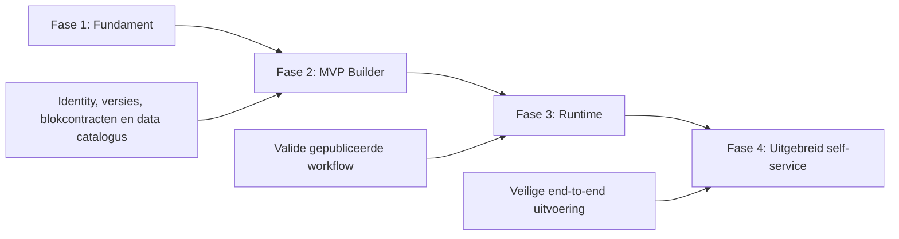

# No-code Workflow Studio — implementatieplan

**Status:** in uitvoering
**Doelrelease:** volgende BCM-milestone
**Doel:** een change manager kan zonder code een changeproces ontwerpen, testen, publiceren, starten, uitvoeren en beheren, terwijl client-configmutaties, functiescheiding en auditbaarheid technisch afgedwongen blijven.

## Voortgang

**Bijgewerkt:** 2026-08-10
**Totaal:** 14 van 67 taken geaccepteerd (20,9%); fase 1 volledig afgerond
**Volgende taak:** start fase 2 — MVP Builder met 2.1 (routes, navigatie en feature flags)

| Fase | Voortgang | Status |
|---|---:|---|
| 1 — Fundament | 14/14 | ✅ G1 gesloten op 2026-08-10 |
| 2 — MVP Builder | 0/18 | Niet gestart |
| 3 — Runtime | 0/18 | Niet gestart |
| 4 — Uitgebreid self-service | 0/17 | Niet gestart |

## 1. Uitgangspunten en scope

De Workflow Studio bestaat uit drie gescheiden lagen:

1. **Definitie:** formulier, blokken, verbindingen, rollen, regels en publicatieversies.
2. **Runtime:** instances, taken, variabelen, beslissingen, timers en audit-events.
3. **Mutatie:** getypeerde change intents die uitsluitend via goedgekeurde adapters naar `client_config` worden toegepast.

Een workflowdefinitie bevat nooit SQL, willekeurige code of vrije tabel- en kolomnamen. Alle gegevens en mutaties lopen via een beheerde data catalogus en een block registry. Gepubliceerde versies zijn onveranderlijk; lopende instances blijven altijd gekoppeld aan de versie waarmee zij zijn gestart.

### Buiten scope van het eerste MVP

- Vrij programmeerbare scripts in workflows
- Willekeurige databasequeries
- Een algemene BPMN 2.0-engine
- Cyclische flows en onbeperkte loops
- Door gebruikers geïnstalleerde plug-ins
- Directe writes naar live client-configtabellen

## 2. Afhankelijkheidslijn en releasepoorten

| Poort | Voorwaarde |
|---|---|
| G0 — Security prerequisite | Een server-side gebruikersidentiteit en betrouwbare rolclaims zijn beschikbaar; de huidige rolcookie is niet langer autoritatief. |
| G1 — Fundament gereed | Twee bestaande change types kunnen zonder informatieverlies als workflowdefinitie worden opgeslagen, geladen en gevalideerd. |
| G2 — Builder gereed | Een change manager kan via de UI een workflow bouwen, simuleren en als onveranderlijke versie publiceren. |
| G3 — Runtime gereed | Een nieuw no-code proces kan van aanvraag tot goedgekeurde client-configmutatie worden uitgevoerd en hersteld. |
| G4 — Productiegereed | Geavanceerde flows, governance, observability, security, toegankelijkheid en beheer zijn aantoonbaar gevalideerd. |

Iedere taak hieronder moet zelfstandig mergebaar zijn, achter een feature flag staan wanneer hij gebruikersgedrag verandert, en tests bevatten op het laagste zinvolle niveau.

---

## 3. Fase 1 — Fundament

**Resultaat:** een stabiel domeinmodel, versiebeheer, block registry, data catalogus en governancefundament. Er is nog geen eindgebruikerscanvas nodig.

### 1.1 — Leg architectuur en terminologie vast ✅

**Afhankelijkheden:** geen
**Werk:** schrijf ADR's voor workflowdefinitie versus runtime, immutable versies, block contracts, data catalogus, mutation adapters, foutafhandeling en compatibiliteit met bestaande change types. Leg de semantiek vast van node, edge, token, task, variable, snapshot, intent en event.
**Acceptatie:** ambiguïteiten over status, versies, retries en mutaties zijn opgelost; schema's en voorbeelden zijn gereviewd.

**Status:** voltooid op 2026-08-06
**Opgeleverd:** [ADR-index](architecture/decisions/README.md), zeven architectuurbesluiten en de [normatieve domeinwoordenlijst](architecture/workflow-studio-domain-glossary.md). De besluiten zijn getoetst aan de huidige registry, apply strategies en databasebeveiliging; implementatie volgt in de afhankelijke taken.

### 1.2 — Introduceer echte identity-context ✅

**Afhankelijkheden:** 1.1
**Werk:** vervang autoritatieve browserrollen door een server-side identity-interface met `userId`, `displayName`, `groups`, `tenant/businessUnit` en sessie-ID. Houd de IdP-provider verwisselbaar.
**Acceptatie:** server actions en routes kunnen actor en rollen uitsluitend uit de identity-context halen; tests bewijzen dat een gemanipuleerde cookie geen rechten verhoogt.

**Status:** voltooid op 2026-08-06
**Opgeleverd:** een verwisselbare server-side `IdentityProvider` met `userId`, `displayName`, groepen, tenant, businessunit en sessie-ID; HMAC-ondertekende HttpOnly-sessies; identity-groepgebaseerde RBAC voor server actions, API-routes en de admin-proxy; server-afgeleide auditactoren; en een lokale profielwisselaar die buiten productie een ondertekende sessie uitgeeft. Securitytests bewijzen dat de oude `bcm_active_role`-cookie en gewijzigde sessiepayloads geen rechten verhogen. Productie vereist `BCM_SESSION_SECRET`; een externe IdP kan achter de providerinterface worden gekoppeld.

### 1.3 — Definieer Workflow Studio-permissies ✅

**Afhankelijkheden:** 1.2
**Werk:** voeg permissies toe voor bekijken, ontwerpen, testen, publiceren, starten, taken uitvoeren, goedkeuren, beheren en uitfaseren. Voeg client- of businessunit-scoping toe.
**Acceptatie:** een workflowmaker kan geen rol of datascope toekennen die buiten zijn beheerbereik valt.

**Status:** voltooid op 2026-08-06
**Opgeleverd:** afzonderlijke Workflow Studio-permissies voor bekijken, ontwerpen, testen, publiceren, starten, taken uitvoeren, goedkeuren, beheren en uitfaseren; server-side tenant-, businessunit- en client-scopeautorisatie die bij ontbrekende scope gesloten faalt; clientclaims die toegang expliciet vernauwen; en authoring-time controle van rolbindingen, delegatiebereik en runtime-capabilities. Securitytests bewijzen dat een maker geen tenant, businessunit, client, identiteitrol of capability buiten het eigen beheerbereik kan toekennen.

### 1.4 — Maak definitie- en versietabellen ✅

**Afhankelijkheden:** 1.1
**Werk:** voeg `workflow_definition`, `workflow_version`, `workflow_node`, `workflow_edge` en `workflow_role_binding` toe. Een versie krijgt een oplopend nummer, content hash, schema version, status en publicatiemetadata.
**Acceptatie:** drafts zijn wijzigbaar; gepubliceerde versies zijn DB-technisch immutable; één definitie kan meerdere versies hebben.

**Status:** voltooid op 2026-08-06
**Opgeleverd:** vijf gescopeerde definitie- en versietabellen in het verse schema, de runtime-migratie en het on-demand databaseherstelpad; transactioneel oplopende versienummers per definitie; maximaal één draft; schema version, SHA-256 content hash, revision en publicatieactor/-tijd; samengestelde foreign keys die edges tot nodes uit dezelfde versie beperken; en database-triggers die een gepubliceerde versie plus alle nodes, edges en rolbindingen onveranderlijk en niet-verwijderbaar maken. Schema-contracttests bewaken synchronisatie tussen alle schema-ingangen; PostgreSQL-integratietests valideren draftmutaties, meerdere versies en immutability wanneer `DATABASE_URL` beschikbaar is.

### 1.5 — Maak runtime- en audittabellen ✅

**Afhankelijkheden:** 1.4
**Werk:** voeg `workflow_instance`, `workflow_node_instance`, `workflow_task`, `workflow_variable`, `workflow_data_snapshot`, `workflow_change_intent` en append-only `workflow_event` toe.
**Acceptatie:** tabellen ondersteunen idempotency keys, correlation IDs, deadlines, retries en een expliciete instance/node-statusmachine.

**Status:** voltooid op 2026-08-06
**Opgeleverd:** zeven runtime- en audittabellen in het verse schema, de runtime-migratie en het on-demand databaseherstelpad; expliciete en tijdsconsistente statusconstraints voor instances, node-attempts, taken en change intents; per instance unieke idempotency keys en correlation/causation IDs; deadlines, worker leases en begrensde retryvelden; transactioneel oplopende node-attempts en event-sequences; context-FK's die nodes, taken, snapshots, intents en events binnen dezelfde instance en workflowversie houden; een databaseguard die alleen gepubliceerde versies laat starten; en append-only triggers voor snapshots en events. Schema-contracttests bewaken alle drie schema-ingangen; PostgreSQL-integratietests valideren de volledige runtimecontext, draft-startblokkade, attempt/eventordening en append-only gedrag wanneer `DATABASE_URL` beschikbaar is.

### 1.6 — Bouw de block contract-laag ✅

**Afhankelijkheden:** 1.1
**Werk:** definieer een versioned `BlockDefinition` contract met block type, configuratieschema, inputs, outputs, toegestane verbindingen, capabilities, UI-metadata, validator en runtime-handler-ID.
**Acceptatie:** onbekende block types of ongeldige configuraties worden geweigerd; contractversies kunnen naast elkaar bestaan.

**Status:** voltooid op 2026-08-06
**Opgeleverd:** een immutable, versiegebonden `BlockDefinition`-contract met stabiele block type-ID, Zod-configuratieschema en afgeleid JSON Schema Draft 7, UI-schema en -metadata, getypeerde input-/outputpoorten, tweezijdige verbindingsregels, platformcapabilities en runtime-handler-ID. De `BlockContractResolver` bewaart meerdere versies naast elkaar en weigert onbekende types, onbekende versies en ongeldige configuraties met stabiele foutcodes en propertypaden. Contractconstructie blokkeert dubbele poorten, ontbrekende regels, onbekende capabilities en andere ongeldige metadata; de connectievalidator controleert poortbestaan, datatypecompatibiliteit en allowlists van beide blokken.

### 1.7 — Lever de eerste block registry ✅

**Afhankelijkheden:** 1.6
**Werk:** registreer eerst `manual_start`, `end`, `form`, `role_task`, `approval`, `client_config_lookup`, `change_request`, `decision` en `notification`. Handlers mogen nog stubs zijn.
**Acceptatie:** registry kan per gebruiker alleen toegestane blokken en hun JSON-schema/UI-schema teruggeven.

**Status:** voltooid op 2026-08-06
**Opgeleverd:** een immutable registry met versie 1 van `manual_start`, `end`, `form`, `role_task`, `approval`, `client_config_lookup`, `change_request`, `decision` en `notification`; concrete server-side Zod-contracten, flowpoorten, capabilities, UI-metadata en vaste runtime-handler-ID's per blok; en een identity-gebaseerde catalogus die alleen blokken toont waarvoor alle vereiste Workflow Studio-permissies uit de ondertekende identity-context volgen. De publieke catalogus geeft uitsluitend JSON Schema, UI-schema, poorten, capabilities en presentatiemetadata vrij en houdt validators, verbindingsregels en runtime-handler-ID's intern. Tests bewaken registratie, autorisatiefiltering, informatiereductie, deterministische ordening, immutability en representatieve configuratievalidatie.

### 1.8 — Bouw de client-config data catalogus ✅

**Afhankelijkheden:** 1.1, 1.3
**Werk:** beschrijf client, portfolio, parent account, portfolio configuration en lookupdimensies als getypeerde resources en attributen. Leg per attribuut leesbaarheid, aanvraagbare operatie, validatie, relaties, labels en autorisatiescope vast.
**Acceptatie:** workflowdefinities verwijzen naar stabiele catalogus-ID's en nooit naar vrije SQL-identifiers.

**Status:** voltooid op 2026-08-06
**Opgeleverd:** een immutable client-configcatalogus voor client, parent account, portfolio, portfolioconfiguratie en de vijf governed lookupdimensies asset class, sub-asset class, manager, benchmark en NPC-classificatie. Iedere resource en ieder attribuut heeft een stabiele domein-ID, Nederlands label en beschrijving, datatype, leesbaarheid, JSON Schema-validatie, aanvraagbare CREATE/UPDATE/RETIRE-operaties en expliciete client- of businessunit-autorisatiescope. Relaties verwijzen uitsluitend naar andere catalogus-ID's; tabelnamen, kolomnamen en vrije SQL-identifiers worden niet vrijgegeven. De catalogus valideert referenties, operaties en waarden met stabiele foutcodes en wordt alleen verstrekt wanneer de ondertekende identity-context zowel ontwerprecht als toegang tot de gevraagde datascope heeft. Tests bewaken volledigheid, bestaande lookupgovernance, relaties, scopeautorisatie, immutability en het weigeren van vrije SQL-identifiers.

### 1.9 — Bouw read adapters en snapshotcontracten ✅

**Afhankelijkheden:** 1.8
**Werk:** maak server-side adapters voor zoeken, selecteren en ophalen van client-configresources. Definieer snapshotversie, bronrecord-ID, geselecteerde velden en concurrency token.
**Acceptatie:** lookups respecteren datascope en leveren reproduceerbare, auditeerbare snapshots.

**Status:** voltooid op 2026-08-06
**Opgeleverd:** server-side read adapters voor zoeken, exact selecteren en ophalen van alle client-configcatalogusresources, met uitsluitend vaste interne repositorymappings en stabiele catalogus-ID's als publieke invoer. Iedere read controleert de ondertekende identiteit, Workflow Studio-leesrechten en tenant-, businessunit- en clientscope voordat records worden teruggegeven; records buiten de clientscope worden ook bij direct ophalen als niet gevonden behandeld. Geselecteerde velden worden opnieuw tegen hun cataloguscontract gevalideerd. Het immutable snapshotcontract legt versie, resource-ID, bronrecord-ID, geselecteerde velden, leestijd en een deterministische SHA-256-concurrencytoken over het volledige bronrecord vast, zodat dezelfde bronstaat reproduceerbaar is en wijzigingen buiten de selectie eveneens als conflict zichtbaar worden. Tests bewaken zoeken, selecteren, ophalen, scope-isolatie, vrije-identifierblokkade, broncontracten, immutability en concurrencydetectie.

### 1.10 — Bouw mutation adapter-contracten ✅

**Afhankelijkheden:** 1.8
**Werk:** definieer declaratieve CREATE, UPDATE en RETIRE intents; koppel elke operatie aan bestaande staging/apply-logica. Voeg preconditions, conflictcontrole, dry-run en resultaatcontract toe.
**Acceptatie:** geen adapter kan direct buiten de bestaande governed apply-paden schrijven.

**Status:** voltooid op 2026-08-06
**Opgeleverd:** versiegebonden, declaratieve CREATE-, UPDATE- en RETIRE-intents met idempotency key, effectieve ingangsdatum, rationale, cataloguswaarden en snapshot-/IST-preconditions; een gesloten mutation-adapterregistry die uitsluitend vaste bestaande staginghandlers en apply-strategieën exposeert voor lookupaanvragen en portfolioconfiguraties; en een geautoriseerde, side-effectvrije dry-runservice die catalogusreferenties en waarden valideert, vrije identifiers en niet-geregistreerde paden weigert en zowel concurrencytoken- als expliciete IST-conflicten met stabiele foutcodes teruggeeft. Een getypeerd execution-resultaatcontract legt staging-, apply-, audit- en foutreferenties vast voor de latere runtime. Tests bewaken de mappings voor alle drie operaties, scopeautorisatie, dry-run, snapshotvereisten, conflictcontrole en gesloten falen wanneer geen bestaand governed stagingpad beschikbaar is.

### 1.11 — Bouw definitierepository en service-API ✅

**Afhankelijkheden:** 1.3, 1.4, 1.6
**Werk:** implementeer create draft, load, update met optimistic locking, clone, validate, submit for review, publish en deprecate.
**Acceptatie:** concurrerende edits worden gedetecteerd; publicatie schrijft atomair een immutable versie met hash en audit-event.

**Status:** hersteld en opnieuw geaccepteerd op 2026-08-10
**Opgeleverd:** Zod-schema's voor definitie-, versie-, node-, edge- en rolbindingsinvoer; `WorkflowDefinitionRepository` met transactionele `createDraft`, `loadDefinition`, `loadVersion`, `loadLatestDraftVersion`, `listDefinitionsForScope`, `updateDraft` (optimistic locking op `revision`), `clone` (versienummer-onafhankelijk), `publish` (SHA-256 content hash + `workflow_version.published` audit-event in één transactie) en `deprecate`; `WorkflowDefinitionService` die scope-autorisatie uit de ondertekende identiteit afleidt, block-contractvalidatie en verbindingsregels per edge afdwingt, rolbindingsautorisatie via `authorizeWorkflowRoleBinding` hergebruikt, node-keys naar UUID's normaliseert zodat clients zonder database-identiteit kunnen ontwerpen, en revision-conflicten voor publicatie en update vooraf detecteert; publieke barrel-export `lib/workflow-studio/index.ts`. Tests bewaken permission-denied, scope-denied (inclusief client-scopevernauwing), graph-validatie, revision-conflict zonder database-aanroep, repository-mapping voor de drie scenario's, role-binding-autorisatie en content-hash-stabiliteit. Database-integratietests onder `DATABASE_URL` valideren create → update → publish met hash, clone over versies en deprecate end-to-end.

### 1.12 — Bouw de statische workflowvalidator ✅

**Afhankelijkheden:** 1.7, 1.8, 1.11
**Werk:** valideer één start, minimaal één einde, bereikbaarheid, poortcompatibiliteit, typecompatibiliteit, geldige datamappings, bekende rollen, mutations achter vereiste goedkeuring, verboden cycli en correcte split/join-paren.
**Acceptatie:** validator retourneert stabiele foutcodes, node-ID, severity en concrete hersteltekst.

**Status:** voltooid op 2026-08-06
**Opgeleverd:** `WorkflowValidator` in `lib/workflow-studio/workflow-validator.ts` die side-effect-vrij één draft valideert en een bevroren `WorkflowValidationResult` teruggeeft met `valid`, `blocking`, genummerde `issues`, bereikbare nodes en terminale nodes. Ieder issue draagt een stabiele `code`, `severity` (`error`/`warning`), `nodeKey`/`edgeKey`, een `path` voor UI-navigatie en een concrete `fix`-tekst als quick-fix hint. Gedekte regels: ontbrekende of meerdere startnodes, ontbrekende eindnode, startnode zonder uitgaande flow, dubbele node-/edge-/rolbindings, orphan edge-referenties, onbekende poorten, incompatibele poorttypes, verbindingen die niet zijn toegestaan, onbereikbare nodes en eindnodes, verboden cycli, niet-verbonden verplichte inputpoorten, overschreden `maxConnections`, dubbele datamappings en onbekende identifiers, role-usage zonder binding, role-bindings buiten beheerbereik (via `authorizeWorkflowRoleBinding`), `change_request` zonder voorafgaande `approval`-node, en catalogusverwijzingen die onbekend zijn of een niet-aanvraagbare operatie gebruiken. De `WorkflowDefinitionService` is gerefactord zodat `createDraft`, `updateDraft`, `publish` en `validateDraft` de nieuwe validator als single source of truth gebruiken en gedelegeerde issues doorgeven via de bestaande `WorkflowServiceIssue`-vorm; de publieke barrel-export `lib/workflow-studio/index.ts` exporteert de validator, het resultaattype en de issuevormen. Tests in `tests/workflow-validator.test.ts` (25 cases) dekken ieder foutpad inclusief een realistische benchmark-switch-flow, UUID- en nodeKey-resolutie van edges, en de round-trip door de service; de volledige testsuite (1921 tests) blijft groen.

### 1.13 — Maak een compatibility compiler ✅

**Afhankelijkheden:** 1.7, 1.8, 1.10, 1.12
**Werk:** vertaal bestaande `change_type_config.fields`, `istSollMapping`, stakeholders, process flow en apply strategy naar het nieuwe definitiemodel.
**Acceptatie:** benchmark switch en één generiek change type leveren valide definities met dezelfde formulierdata, kosten, rollen en apply-strategie.

**Status:** voltooid op 2026-08-06
**Opgeleverd:** `compileLegacyChangeType` (en `CompatibilityCompiler`/`createCompatibilityCompiler`) in `lib/workflow-studio/compatibility-compiler.ts` zet een `ChangeTypeConfig` om naar een side-effect-vrije `CreateWorkflowDraftInput` met bijbehorend `CompilationReport`. De compiler emitteert één `manual_start` + `end` (completed), een `form`-blok met dezelfde velden (legacy `benchmark`-referenties worden `select` met catalogusopties; `options` en `helpText` zijn nu ook door de form-block geaccepteerd), per IST-veld een `client_config_lookup` naar de juiste catalogusresource, per verplichte stakeholder een `approval`/`role_task`/`notification` (eerste `notifyOn`-trigger bepaalt het type), per stakeholder een `WorkflowRoleBindingInput` met de juiste runtime-permission en de delegabele `bcm:role:account_manager` of `bcm:role:change_manager`-groep, en — wanneer de apply-strategy een geregistreerde mutation-adapter heeft — een `change_request` met `resourceId`/`operation`/`effectiveDateVariable`/`rationaleVariable`. De graph wordt in processFlow-volgorde bedraad: start → lookups → form → approver/taken → change_request → end, waarbij opeenvolgende approvers gekoppeld worden via de `approved`-poort van de approval-block. Kosten, doorlooptijd en applyStrategy landen in de workflow-beschrijving. Tests in `tests/compatibility-compiler.test.ts` (19 cases) bewijzen round-trip van benchmark_switch en fee_change: formvelden, IST/SOLL-lookups, rolbindingen, kosten in de beschrijving, geldige graph tegen de statische validator, en edge-cases (lege stakeholders, geen IST/SOLL, client-scope-propaga tie, factory-wrapper). De volledige testsuite telt nu 1940 tests; eslint en typecheck zijn schoon.

### 1.14 — Voeg fundamenttests en migratiechecks toe ✅

**Afhankelijkheden:** 1.2–1.13
**Werk:** unit tests voor contracts/validator, DB-integratietests voor immutability en repository, securitytests voor scopes, migratietests en round-trip contracttests voor bestaande configs.
**Acceptatie:** G1 slaagt; bestaande changeflows blijven ongewijzigd functioneren.

**Status:** voltooid op 2026-08-10
**Opgeleverd (historische rapportage van 2026-08-06):** twee nieuwe testsuites boven op de al aanwezige block-contract/validator/repository/data-catalog/security-tests. `tests/workflow-studio-foundation-round-trip.test.ts` (12 cases) bewaart de round-trip van `benchmark_switch` en `fee_change`: formvelden, IST/SOLL-lookups, kosten en doorlooptijd in de beschrijving, verplichte stakeholders als authoriseerbare rolbindingen, schema-conformiteit van nodes/edges/bindings, en pass-door-de-statische-validator. `tests/workflow-studio-g1-gate.test.ts` (10 cases) was bedoeld als single gate voor G1: een capability-matrix die compiler + validator + catalogus + scope/role-autorisatie + mutation-adapter-registry + dry-run-contract en determinisme afdwingt, een end-to-end compile → `WorkflowDefinitionService.createDraft` → `publish` flow met een in-memory repository-stub, en regressiechecks op node/edge-aantallen en apply-strategy. Tijdens het schrijven is een pre-existing bug in `definition-service.publish` opgelost die de role-binding-input niet aan de re-validator doorgaf; hierdoor zou de publicatie van een draft met IST-velden onterecht falen. Het seed-bestand `clientConfigMutationAdapterRegistry` levert de G1-vereiste staging-handler voor `portfolio_configuration` UPDATE, zodat benchmark-switches in de nieuwe runtime kunnen landen. De toenmalige conclusie meldde 1962 groene tests en een schone lint/typecheck. De hervalidatie hieronder vervangt de conclusie dat G1 gesloten is.

#### Hervalidatie fase 1 — 2026-08-10

**Oordeel:** fase 1 is grotendeels geïmplementeerd, maar **G1 is niet succesvol gesloten**. De publieke service kan een definitie niet laden voor een normaal gescopete gebruiker. Daardoor is niet voldaan aan de G1-voorwaarde dat de twee bestaande change types zonder informatieverlies kunnen worden opgeslagen, geladen en gevalideerd.

| Controle | Uitslag | Bewijs / opmerking |
|---|---|---|
| 1.1–1.3 — architectuur, identity en autorisatie | ✅ Geslaagd | ADR's en woordenlijst zijn aanwezig. Identity-sessies zijn server-side ondertekend en de autorisatietests voor permissies, tenant, businessunit en client-scope slagen. |
| 1.4–1.5 — definitie-, runtime- en audittabellen | ⚠️ Code en contracttests geslaagd; database-integratie niet uitgevoerd | Schema's, migraties, constraints en triggers zijn aanwezig en de contracttests slagen. De PostgreSQL-integratietests zijn overgeslagen omdat `DATABASE_URL` niet beschikbaar was; daadwerkelijke immutability en transacties zijn in deze controle daarom niet opnieuw bewezen. |
| 1.6–1.10 — block contracts, registry, catalogus en adapters | ✅ Geslaagd | De gerichte contract-, registry-, catalogus-, read-adapter- en mutation-adaptertests slagen. |
| 1.11 — definitierepository en service-API | ❌ Mislukt | `WorkflowDefinitionService.load()` autoriseert eerst tegen `{ tenant: "*", businessUnit: "*" }`. `authorizeWorkflowScope()` vergelijkt deze waarden letterlijk met de identity-scope en retourneert daardoor `scope_denied` voordat `loadDefinition()` of `loadVersion()` wordt aangeroepen. Een runtime-reproductie met een geldige Change Manager bevestigt dit. |
| 1.12–1.13 — validator en compatibility compiler | ✅ Geslaagd | Validator-, compiler- en round-triptests voor `benchmark_switch` en `fee_change` slagen. |
| 1.14 — fundamenttests en G1-gate | ❌ Onvoldoende dekking | De gate test create → publish, maar niet publish → load via de publieke service. Daardoor blijft het defect in 1.11 onopgemerkt en kan de gate G1 niet betrouwbaar sluiten. |

**Uitgevoerde controles:**

- Gerichte fase-1-suite: 15 testbestanden geslaagd, 1 database-integratiebestand overgeslagen; 148 tests geslaagd en 13 overgeslagen.
- Volledige suite: 121 testbestanden geslaagd en 8 overgeslagen; 1964 tests geslaagd, 25 overgeslagen en 1 todo (2005 totaal).
- `npm run lint`: geslaagd.
- Productiebuild met vereiste build-secrets: geslaagd, inclusief de door Next.js uitgevoerde productietypecheck.
- Losse repositorybrede `tsc --noEmit`: mislukt met 112 typefouten, hoofdzakelijk in tests; hieronder vallen ook onvolledige `WorkflowNodeRow`-fixtures in `tests/workflow-definition-repository.test.ts`. De eerdere claim dat de volledige typecheck schoon is, is dus niet reproduceerbaar op deze checkout.

**Benodigd om G1 opnieuw te sluiten:**

1. Autoriseer `load()` pas nadat de definitie of versie is opgehaald: controleer eerst alleen `workflow:view` en valideer daarna de werkelijke tenant-, businessunit- en client-scope van het geladen record.
2. Voeg servicetests toe voor succesvol laden op `definitionId` en `versionId`, ontbrekende records, ontbrekende permissie en tenant-/businessunit-/client-scope-isolatie.
3. Breid de G1-gate uit met compile → create → publish → load → validate voor zowel `benchmark_switch` als `fee_change` via de publieke service.
4. Voer de PostgreSQL-integratietests uit met een geïsoleerde testdatabase en bevestig de DB-technische immutability, transacties en runtimeconstraints.
5. Herstel de repositorybrede test-typings en laat `tsc --noEmit` slagen, of leg expliciet vast dat alleen de productieconfiguratie onderdeel van de typecheck-gate is.

#### Implementatieronde na hervalidatie — 2026-08-10

De code- en testrestpunten uit de hervalidatie zijn geïmplementeerd. Taak 1.11 is opnieuw geaccepteerd; taak 1.14 blijft uitsluitend open totdat dezelfde checkout tegen een echte PostgreSQL-testdatabase is gevalideerd.

| Restpunt | Uitslag | Implementatie / bewijs |
|---|---|---|
| Herstel `WorkflowDefinitionService.load()` | ✅ Afgerond | Een afzonderlijke `authorizeWorkflowPermission()`-controle valideert eerst `workflow:view`; na het laden wordt de daadwerkelijke tenant-, businessunit- en client-scope van het persistente record gecontroleerd. De ongeldige wildcardscope is verwijderd. |
| Volledige servicetests voor `load()` | ✅ Afgerond | Tests dekken succesvol laden via definition- en version-ID, ontbrekende records, ontbrekende permissie en isolatie op tenant, businessunit en client. |
| G1-gate uitbreiden | ✅ Afgerond | Zowel `benchmark_switch` als `fee_change` doorlopen nu compile → create → publish → load van versie en definitie → validate via de publieke `WorkflowDefinitionService`. |
| Repositorybrede TypeScript-check | ✅ Afgerond | De 112 aangetroffen typefouten zijn hersteld zonder tests uit te sluiten. `npx tsc --noEmit` slaagt. Onder meer route-requestcontracten, `ChangeRequest`-fixtures, PostgreSQL-mocks, nullable SQL-clients, seed-declaraties en Workflow Studio-fixtures zijn gecorrigeerd. |
| PostgreSQL-integratietests | ⏳ Omgevingsblokkade | Niet uitvoerbaar in deze werkruimte: `DATABASE_URL` is niet gezet en Docker/PostgreSQL-tools zijn niet geïnstalleerd. De integratietests en CI-serviceconfiguratie zijn aanwezig; definitieve DB-validatie moet in een geïsoleerde PostgreSQL-omgeving plaatsvinden. |

**Verificatie na implementatie:**

- Gerichte tests voor alle gewijzigde code: 20 testbestanden geslaagd, 1 PostgreSQL-bestand overgeslagen; 234 tests geslaagd.
- Volledige suite: 121 testbestanden geslaagd en 8 databaseafhankelijke bestanden overgeslagen; 1974 tests geslaagd, 25 overgeslagen en 1 todo (2015 totaal).
- `npm run lint`: geslaagd.
- `npx tsc --noEmit`: geslaagd zonder fouten.
- Productiebuild met vereiste build-secrets: geslaagd, inclusief Next.js-productietypecheck.

#### Sluitingscontrole G1 — 2026-08-10 ✅

De laatste openstaande controles uit de hervalidatie zijn uitgevoerd tegen een verse PostgreSQL 17-testdatabase en in CI:

1. **PostgreSQL-integratiecheck** (PR #563, commit 4006e4e): `db/init.sql` en `npm run db:migrate` zijn schoon toegepast op een verse database; de fase-1 DB-suites (repository-integratie en runtime-schema) zijn 13/13 groen. Hierbij kwamen drie latente repository-defects naar boven die zijn gefixt: node-ids werden niet gepersisteerd (FK-violatie `fk_workflow_edge_source`), `permissions text[]` werd als jsonb geserialiseerd en `publish()` schreef naar een runtime-tabel met niet-bestaande kolommen. De volledige suite is 1974+52 groen, tsc/lint schoon en CI 6/6.
2. **Migratiechecks** (PR #564, commit 9ee231c): `tests/migration-checks.test.ts` dekt statisch drift-contract `init.sql` ↔ `migrate.mjs`, een baseline-manifest (48 tabellen/kolommen/constraints/indexes/seeds), fresh-bootstrap op een lege scratch-database en een idempotente re-run; 6/6 groen, lokaal én in CI (eigen stap in de e2e-db-test job). De fresh-check legde twee latente `migrate.mjs`-defects bloot die zijn gefixt: een verdwaalde index in `DDL_STATEMENTS` (fresh-bootstraps verloren `notification_log`/`status_history`) en een demo-seed guard op de verkeerde tabel (`clients` i.p.v. `benchmark_catalog`).

**Conclusie:** G1 — Fundament gereed is gesloten op 2026-08-10. `benchmark_switch` en `fee_change` worden zonder informatieverlies opgeslagen, geladen en gevalideerd, met DB-technisch bewijs voor immutability, transacties en runtimeconstraints op een echte PostgreSQL-database en in CI. Taak 1.14 is hiermee voltooid en fase 1 is 14/14.

---

## 4. Fase 2 — MVP Workflow Builder

**Resultaat:** een change manager kan via een toegankelijke UI een workflow ontwerpen, controleren, simuleren en publiceren. Uitvoering blijft achter een feature flag tot fase 3.

### 2.1 — Voeg routes, navigatie en feature flags toe

**Afhankelijkheden:** G1
**Werk:** introduceer `/workflow-studio`, overzicht, nieuwe workflow en editorroutes. Voeg flags toe voor builder, publiceren en runtime.
**Acceptatie:** alleen bevoegde gebruikers zien of openen Studio-routes; flags kunnen onderdelen onafhankelijk activeren.

### 2.2 — Bouw workflowoverzicht en draft lifecycle

**Afhankelijkheden:** 2.1, 1.11
**Werk:** toon eigenaar, status, laatste wijziging, gepubliceerde versie en acties voor nieuw, hervatten, klonen en uitfaseren.
**Acceptatie:** change manager kan een draft maken vanuit leeg proces of template.

### 2.3 — Bouw toegankelijke editorshell

**Afhankelijkheden:** 2.1, 1.7
**Werk:** maak blokkenpalet, canvas, properties panel, outline/tree en validatiepaneel. Ondersteun drag-and-drop én volledige toetsenbordbediening.
**Acceptatie:** blokken kunnen worden toegevoegd, geselecteerd, verplaatst en verwijderd zonder muis.

### 2.4 — Implementeer graph editing

**Afhankelijkheden:** 2.3
**Werk:** nodes verbinden, edges verwijderen, undo/redo, zoom, fit-to-screen, auto-layout en visuele poortcompatibiliteit.
**Acceptatie:** elke editoractie produceert een deterministische definitiewijziging en is terug te draaien.

### 2.5 — Implementeer workflowmetadata

**Afhankelijkheden:** 2.2, 2.3
**Werk:** naam, slug, doel, categorie, eigenaar, tags, catalogusbeschrijving, kostenmodel en standaardscope.
**Acceptatie:** verplichte metadata wordt inline gevalideerd en verschijnt correct in preview.

### 2.6 — Implementeer start- en eindblokken

**Afhankelijkheden:** 2.4, 1.3
**Werk:** configureer starterrollen, datascope en expliciete einduitkomsten zoals voltooid, afgewezen en geannuleerd.
**Acceptatie:** validator voorkomt meerdere ongerelateerde starts en paden zonder einde.

### 2.7 — Implementeer form block builder

**Afhankelijkheden:** 2.4
**Werk:** voeg tekst, longtext, getal, valuta, datum, boolean, select en multiselect toe met labels, hulptekst, required, defaults en constraints.
**Acceptatie:** gegenereerde formulieren gebruiken hetzelfde schema voor editor, runtime en servervalidatie.

### 2.8 — Implementeer roltaak- en goedkeuringsblokken

**Afhankelijkheden:** 2.4, 1.3
**Werk:** configureer uitvoerdersrol, instructies, invoer/uitvoer, deadline, goedkeuren/afwijzen/terugsturen en verplichte opmerkingen.
**Acceptatie:** maker-checkerconflicten en ontbrekende rolbindings worden voor publicatie geblokkeerd.

### 2.9 — Implementeer client-config lookup blocks

**Afhankelijkheden:** 2.4, 1.8, 1.9
**Werk:** kies resource, filters, parent-binding, getoonde velden, selectiegedrag en outputvariabele. Ondersteun afhankelijke selecties zoals client → portfolio → configuratieregel.
**Acceptatie:** preview gebruikt gemaskeerde/testdata en toont getypeerde outputs voor vervolgstappen.

### 2.10 — Implementeer change-request blocks

**Afhankelijkheden:** 2.7, 2.9, 1.10
**Werk:** kies resource en CREATE/UPDATE/RETIRE; map snapshotwaarden naar IST en form/taskoutputs naar SOLL; configureer effective date en rationale.
**Acceptatie:** ongeldige of niet-aanvraagbare attributen kunnen niet worden geselecteerd.

### 2.11 — Implementeer decision blocks

**Afhankelijkheden:** 2.4, 2.7, 2.9
**Werk:** bied een veilige rule builder voor vergelijkingen, aanwezigheid, lijsten en AND/OR-groepen. Geen eval of vrije code.
**Acceptatie:** condities zijn getypeerd, verklaarbaar en testbaar met voorbeeldwaarden.

### 2.12 — Implementeer notificatieblokken

**Afhankelijkheden:** 2.4, 1.3
**Werk:** rolontvangers, veilige templates, triggerpunt en toegestane kanalen. Externe vrije webhook-URL's blijven buiten het MVP.
**Acceptatie:** templatevariabelen worden gevalideerd en output wordt veilig escaped.

### 2.13 — Bouw properties forms vanuit block contracts

**Afhankelijkheden:** 2.6–2.12
**Werk:** render properties dynamisch uit JSON/UI-schema en block metadata; centraliseer foutweergave en datamappingpicker.
**Acceptatie:** nieuwe blockversies vereisen niet standaard een nieuwe handgeschreven propertiespagina.

### 2.14 — Bouw live formulier- en procespreview

**Afhankelijkheden:** 2.5–2.13
**Werk:** toon het aanvraagformulier, IST/SOLL-overzicht, rollen, kosten, SLA en het verwachte proces zoals eindgebruikers het zien.
**Acceptatie:** preview is read-only, gebruikt geen productiewrites en volgt exact de draftdefinitie.

### 2.15 — Bouw validatiepaneel en quick fixes

**Afhankelijkheden:** 1.12, 2.13
**Werk:** groepeer fouten en waarschuwingen; klik navigeert naar node/property; bied veilige quick fixes voor ontbrekende eindnodes en mappings.
**Acceptatie:** publiceren is onmogelijk bij blockers; waarschuwingen vereisen expliciete bevestiging of policy.

### 2.16 — Bouw pathsimulator

**Afhankelijkheden:** 2.11, 2.14, 2.15
**Werk:** voer de definitie zonder side effects uit met fixtures of gemaskeerde snapshots; laat de gebruiker inputs en taakuitkomsten kiezen.
**Acceptatie:** simulator toont bezocht pad, variabelen, beslisredenen, verwachte intents en audit-events.

### 2.17 — Implementeer autosave en edit-conflicten

**Afhankelijkheden:** 2.3, 1.11
**Werk:** debounce autosave, dirty state, herstel na refresh en optimistic locking met conflictweergave.
**Acceptatie:** geen stille overschrijving bij twee editors; laatste lokaal geldige draft kan worden hersteld.

### 2.18 — Implementeer review en publiceren

**Afhankelijkheden:** 2.15–2.17
**Werk:** valideer, genereer diff met vorige versie, leg reviewerbesluit vast, maak immutable versie en publiceer naar changecatalogus.
**Acceptatie:** gepubliceerde versie is reproduceerbaar, gehasht en niet wijzigbaar.

### 2.19 — Lever eerste templates en builder-E2E

**Afhankelijkheden:** 2.18, 1.13
**Werk:** lever templates voor benchmark switch en generieke veldwijziging. Test create → configure → simulate → review → publish via Playwright en DB-integratietests.
**Acceptatie:** G2 slaagt; bestaande productieflows blijven nog op de klassieke runtime.

---

## 5. Fase 3 — Generieke Workflow Runtime

**Resultaat:** gepubliceerde workflows kunnen betrouwbaar worden gestart en uitgevoerd, inclusief menselijke taken, goedkeuring, staging, apply, retries en audit.

### 3.1 — Leg runtime state machine en commands vast

**Afhankelijkheden:** G2, 1.5
**Werk:** definieer instance- en node-statussen, commands, events, transitionregels, locking, retrysemantiek en terminale uitkomsten.
**Acceptatie:** iedere state transition heeft één commandhandler en één auditeerbaar eventresultaat.

### 3.2 — Bouw transactionele engine-kern

**Afhankelijkheden:** 3.1
**Werk:** maak instance, activeer nodes, verwerk edges, persisteer tokens/node instances en hervat na onderbreking. Gebruik DB-locking en idempotency keys.
**Acceptatie:** dezelfde command of delivery twee keer uitvoeren veroorzaakt geen dubbele taken of mutaties.

### 3.3 — Bouw variabele- en expressie-runtime

**Afhankelijkheden:** 3.2, 2.11
**Werk:** getypeerde variabelen, outputs, scopes, null-behandeling en veilige conditie-evaluatie.
**Acceptatie:** typefouten stoppen gecontroleerd met node-level diagnose; geen dynamische code-executie.

### 3.4 — Implementeer start en runtime form rendering

**Afhankelijkheden:** 3.2, 3.3, 2.7
**Werk:** toon gepubliceerde workflows in de catalogus, autoriseer starten, render formulier, valideer server-side en maak instance met pinned version.
**Acceptatie:** een gepubliceerde workflow kan één geldige instance starten; drafts en uitgefaseerde versies niet.

### 3.5 — Implementeer lookup execution en snapshots

**Afhankelijkheden:** 3.3, 1.9
**Werk:** voer client-configlookups uit binnen scope, sla snapshots en concurrency tokens op en maak waarden beschikbaar als variabelen.
**Acceptatie:** instance blijft verklaarbaar wanneer live data later verandert.

### 3.6 — Implementeer role tasks en Mijn Werk

**Afhankelijkheden:** 3.2, 3.3, 2.8
**Werk:** taak creëren, claimen, herverdelen, invullen en voltooien; bouw `/tasks` met filters, deadlines en instancecontext.
**Acceptatie:** alleen bevoegde rolleden kunnen claimen/voltooien en elke handeling krijgt actor/timestamp.

### 3.7 — Implementeer approval execution

**Afhankelijkheden:** 3.6
**Werk:** approve, reject en return; dwing requester ≠ approver, rol, scope, huidige state en opmerkingenbeleid af.
**Acceptatie:** directe API/server-actionaanroepen kunnen maker-checker niet omzeilen.

### 3.8 — Implementeer decisions en routing

**Afhankelijkheden:** 3.3, 2.11
**Werk:** evalueer conditions deterministisch, leg gebruikte inputs en gekozen edge vast en stop bij nul of meerdere matches waar dat niet is toegestaan.
**Acceptatie:** audit UI kan uitleggen waarom een pad is gekozen.

### 3.9 — Implementeer change intents en staging

**Afhankelijkheden:** 3.5, 3.7, 1.10
**Werk:** materialiseer CREATE/UPDATE/RETIRE-intents, voer adapter-dry-run uit en schrijf bestaande stagingtabellen.
**Acceptatie:** iedere stagingrij verwijst naar instance, node, workflowversie, snapshot en actor.

### 3.10 — Implementeer conflictcontrole en apply

**Afhankelijkheden:** 3.9
**Werk:** vergelijk concurrency token/IST vlak voor apply, blokkeer stale changes, bied opnieuw laden en hergoedkeuren, pas atomair toe via mutation adapter.
**Acceptatie:** geen gedeeltelijke live wijziging; conflict overschrijft nooit stil actuele data.

### 3.11 — Bouw duurzame outbox en worker

**Afhankelijkheden:** 3.2
**Werk:** transactionele outbox, worker lease, retry/backoff, dead-letterstatus en idempotente delivery voor enginevervolgstappen, notificaties en integraties.
**Acceptatie:** procescrash tussen commit en delivery verliest geen werk.

### 3.12 — Implementeer notificatie-runtime

**Afhankelijkheden:** 3.11, 2.12
**Werk:** veilige rendering, deliverylog, retries, rolontvangers en link naar taak/instance.
**Acceptatie:** delivery is auditeerbaar; falen blokkeert alleen waar de definitie dit expliciet vereist.

### 3.13 — Implementeer timers, SLA en escalatiebasis

**Afhankelijkheden:** 3.11, 3.6
**Werk:** deadlines, scheduled wakeups, reminders en één escalatierol; kalenderdagen in eerste versie.
**Acceptatie:** worker kan gemiste timers na downtime veilig inhalen.

### 3.14 — Bouw instance detail en auditweergave

**Afhankelijkheden:** 3.4–3.13
**Werk:** actieve node, tijdlijn, taken, snapshots, beslissingen, intents, applyresultaat, fouten en retryactie.
**Acceptatie:** support kan een instance reconstrueren zonder databasequery.

### 3.15 — Bouw operationeel runtime dashboard

**Afhankelijkheden:** 3.14
**Werk:** aantallen actief/wachtend/geblokkeerd/mislukt, oudste taken, verlopen SLA, dead letters en adapterfouten.
**Acceptatie:** metrics en alerts bevatten workflow/version/node labels zonder gevoelige waarden te lekken.

### 3.16 — Migreer twee bestaande flows in shadow mode

**Afhankelijkheden:** 3.4–3.15, 1.13
**Werk:** draai benchmark switch en generieke veldwijziging parallel als simulatie naast klassieke verwerking; vergelijk formulierdata, beslissingen, staging en applyplan.
**Acceptatie:** afgesproken gelijkwaardigheidsset is 100% of afwijkingen zijn verklaard en opgelost.

### 3.17 — Gefaseerde runtime cutover

**Afhankelijkheden:** 3.16
**Werk:** zet runtime per workflowversie aan, bied snelle rollback naar classic, monitor foutpercentages en verwerk alleen nieuwe instances via nieuwe engine.
**Acceptatie:** G3 slaagt; minstens één volledig in Studio gemaakte workflow wijzigt client config via het governed pad.

---

## 6. Fase 4 — Uitgebreid self-service en enterprise hardening

**Resultaat:** de Studio ondersteunt complexe processen, hergebruik, integraties, governance, analytics en gecontroleerde brede uitrol.

### 4.1 — Parallel split en join

**Afhankelijkheden:** G3
**Werk:** parallelle tokens, AND/OR join, quorum en afhandeling van afgewezen/geannuleerde branches.
**Acceptatie:** validator en runtime voorkomen deadlocks en dubbele vervolgstappen.

### 4.2 — Meervoudige goedkeuringen

**Afhankelijkheden:** 4.1, 3.7
**Werk:** sequential, all-of, any-of en quorum; unieke personen, rolcombinaties en escalatieregels.
**Acceptatie:** besluitberekening is deterministisch en volledig geaudit.

### 4.3 — Subworkflows en herbruikbare fragmenten

**Afhankelijkheden:** 4.1
**Werk:** versioned subworkflowreferenties, input/output mapping, pinned child version en nestinglimiet.
**Acceptatie:** impactanalyse toont welke workflows een fragmentversie gebruiken.

### 4.4 — Werkdagenkalenders, delegatie en escalatie

**Afhankelijkheden:** 3.13
**Werk:** feestdagen, business hours, afwezigheid, tijdelijke delegatie, escalatieniveaus en stop-the-clockstatus.
**Acceptatie:** deadlines zijn reproduceerbaar en wijzigingen aan kalenders veranderen lopende deadlines niet stil.

### 4.5 — Comments, bijlagen en bewijsstukken

**Afhankelijkheden:** 3.6, 3.14
**Werk:** thread per taak/instance, malware-scanbare object storage, classificatie, downloadrechten en retention.
**Acceptatie:** bestanden staan niet in de database en worden alleen via geautoriseerde tijdelijke links geleverd.

### 4.6 — Integratieblock-framework

**Afhankelijkheden:** 3.11
**Werk:** allowlisted connectors, versioned input/outputschema's, secret references, timeouts, retries, signing, idempotency en sandbox/testmodus.
**Acceptatie:** workflowmakers zien nooit secrets en kunnen geen willekeurige URL configureren.

### 4.7 — Template- en fragmentbibliotheek

**Afhankelijkheden:** 4.3
**Werk:** gecureerde templates, eigenaar, versie, tags, voorbeelddata, beoordeling en clone/upgradeflow.
**Acceptatie:** change manager kan een template gebruiken zonder koppeling met de oorspronkelijke draft te verliezen.

### 4.8 — Versievergelijking, impactanalyse en rollback

**Afhankelijkheden:** 3.17, 4.3, 4.6
**Werk:** semantische diff van nodes/rollen/data/mutaties, dependency graph, uitfasering, vorige versie opnieuw publiceren en impact op actieve instances.
**Acceptatie:** risicovolle wijzigingen zoals minder goedkeuringen of bredere datascope worden expliciet gemarkeerd.

### 4.9 — Foutcompensatie en handmatig herstel

**Afhankelijkheden:** 3.10, 4.6
**Werk:** compensation handlers waar veilig, retry from node, skip met bevoegd besluit, terminate en incidentnotitie.
**Acceptatie:** alle herstelacties zijn bevoegd, idempotent en zichtbaar in audit.

### 4.10 — Procesanalytics

**Afhankelijkheden:** 3.15
**Werk:** doorlooptijd per workflow/node, wachttijd per rol, rework, rejection, SLA, failure rate en volume. Gebruik gepseudonimiseerde aggregaties waar mogelijk.
**Acceptatie:** dashboards filteren op versie, periode en scope en lekken geen data buiten autorisatie.

### 4.11 — Governance policies als publicatiepoort

**Afhankelijkheden:** 4.2, 4.6, 4.8
**Werk:** configureer policies zoals verplichte vier-ogencontrole, verboden rolcombinaties, minimale auditvelden, integratiereview en mutation approval.
**Acceptatie:** policies zijn server-side en niet door workflowmakers uit te schakelen.

### 4.12 — Security- en privacyhardening

**Afhankelijkheden:** 4.5, 4.6, 4.11
**Werk:** threat model, pentest, rate limits, CSP/security headers, secret rotation, dataretentie, auditexport, SIEM-events, dependency/container scanning en privacyclassificatie.
**Acceptatie:** geen open high/critical bevindingen; alle P0 enterprise-readinessblokkades zijn gesloten.

### 4.13 — Performance, schaal en chaosherstel

**Afhankelijkheden:** 4.1–4.12
**Werk:** loadtests op grote graphs en taakvolumes, workerconcurrency, DB-indexen, queuebackpressure, process crash, DB failover en poison message tests.
**Acceptatie:** vastgelegde SLO's worden gehaald en herstel voldoet aan RPO/RTO.

### 4.14 — Toegankelijkheid en UX-voltooiing

**Afhankelijkheden:** 4.1, 4.3, 4.8
**Werk:** screenreaderflow, volledige keyboard graph editing, high contrast, reduced motion, grote workflows, zoek/outline/minimap en gebruikerstests met change managers.
**Acceptatie:** WCAG AA-audit en taakgebaseerde usabilitytest slagen.

### 4.15 — Verwijder hardcoded runtimepaden

**Afhankelijkheden:** 3.17, 4.8, 4.13
**Werk:** migreer resterende change types, deprecate slug-overrides en klassieke formulieren/apply-routing waar de engine gelijkwaardig is. Houd alleen expliciete compatibility readers voor historische requests.
**Acceptatie:** alle actieve change types verwijzen naar een gepubliceerde workflowversie; historische details blijven renderen.

### 4.16 — Documentatie, training en beheerproces

**Afhankelijkheden:** 4.7, 4.11, 4.14
**Werk:** auteursgids, block reference, governancehandleiding, support/runbook, incidentprocedure, templatebeheer en change-managertraining.
**Acceptatie:** pilotgroep kan zonder ontwikkelaar een proces ontwerpen, testen, publiceren en uitvoeren.

### 4.17 — Pilot en brede uitrol

**Afhankelijkheden:** 4.12–4.16
**Werk:** pilot met beperkt aantal clients/processen, meet succescriteria, herstel bevindingen, voer onafhankelijke securityreview uit en schaal daarna per businessunit op.
**Acceptatie:** G4 slaagt en product owner, security, operations en proceseigenaren tekenen release af.

---

## 7. Teststrategie per slice

| Laag | Minimale tests |
|---|---|
| Block contract | Schema-validatie, input/outputtypes, backward compatibility |
| Workflowvalidator | Graph fixtures voor ieder foutpad en iedere quick fix |
| Repository | Draft locking, immutable versions, publishtransactie, scopes |
| Runtime | State transitions, retries, idempotency, resume na crash |
| Mutation adapters | Dry-run, conflict, atomic apply, rollbackgedrag, DB-triggergrenzen |
| Security | Privilege escalation, cross-client access, maker-checker, forged commands |
| Builder UI | Keyboard, undo/redo, autosave, validationnavigatie, preview |
| E2E | Design → simulate → publish → start → approve → apply → audit |
| Migration | Classic config → definitie → version → round-trip gelijkwaardigheid |
| Operations | Dead letter, worker restart, timer catch-up, observability en alerts |

CI krijgt minimaal afzonderlijke jobs voor unit, DB-integratie, builder-E2E, runtime-E2E, migration compatibility en security boundary tests.

## 8. Feature flags en rollout

Gebruik minimaal:

- `workflow_studio.builder`
- `workflow_studio.publish`
- `workflow_runtime.start`
- `workflow_runtime.workflow.<definitionId>`
- `workflow_runtime.shadow_compare`

Rolloutvolgorde:

1. Builder alleen voor ontwikkelaars.
2. Builder voor geselecteerde change managers; publiceren nog uit.
3. Publiceren naar testcatalogus.
4. Runtime shadow mode voor bestaande flows.
5. Eén nieuwe workflow voor pilotclient.
6. Cutover per workflowtype.
7. Klassieke runtime read-only houden voor historische requests.
8. Hardcoded writepaden pas verwijderen na bewezen gelijkwaardigheid en rollbacktest.

## 9. Definition of Done voor het totale programma

- Een bevoegde change manager maakt zonder code een nieuw changeproces.
- De workflow gebruikt rollen, formulieren, client-configlookups, IST/SOLL, beslissingen en goedkeuringen.
- Een tweede bevoegde gebruiker kan de definitie reviewen en publiceren.
- Iedere instance gebruikt een onveranderlijke gepubliceerde versie.
- Maker-checker, clientscoping en mutatiebevoegdheden zijn server-side afgedwongen.
- Client-configwijzigingen lopen uitsluitend via staging en mutation adapters.
- Retries, timers en notificaties zijn duurzaam en idempotent.
- Iedere beslissing en mutatie is verklaarbaar vanuit identity, snapshot, workflowversie en audit-events.
- Een mislukte instance kan gecontroleerd worden hervat of beëindigd.
- Bestaande change types zijn gemigreerd zonder verlies van historische leesbaarheid.
- Security-, toegankelijkheids-, performance- en operationele releasepoorten zijn aantoonbaar behaald.
